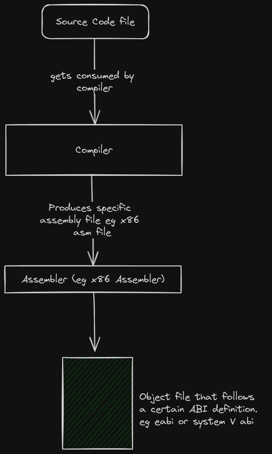
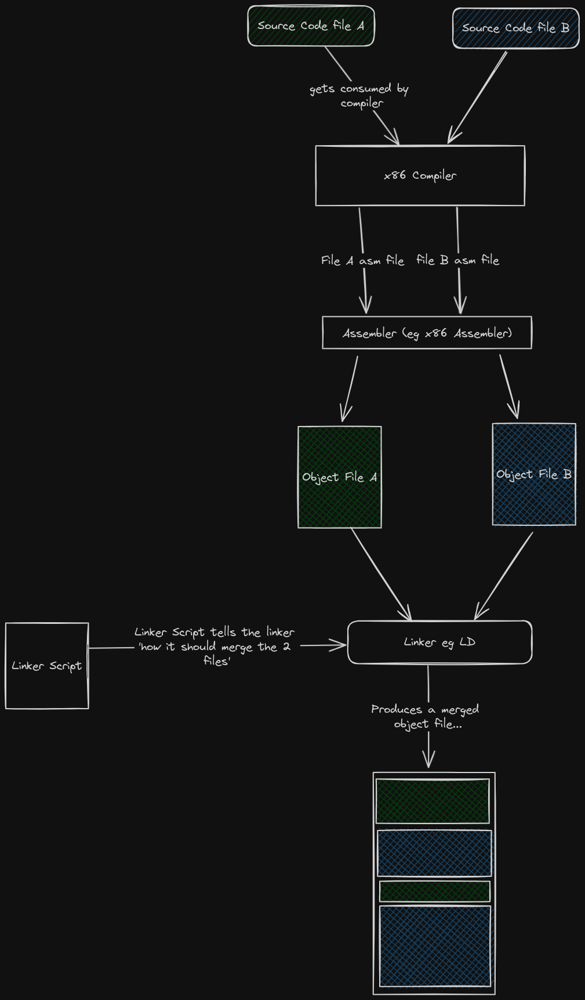

# Cross-Compilation

## Normal Compilation
**Compilation** is the process of converting source code into machine code. For example, converting hello-world to machine code for either a x86 CPU or a Riscv Chip.  

The compilation process for a single file roughly looks like this ...  



When multiple files need to get compiled together, the linker gets introduced : 
  


## Target 

If we are compiling program `x` to run on machine `y`, then machine `y` is typically referred to as the `Target`.  

If we compile the hello-world for different targets, we may end up with object files that are completely different from each other in terms of file format and file content.  
This is because the format and contents of the object file are majorly affected by the following factors : 
1. The CPU Architecture of the target
2. The Vendor-specific implementations on both the software and hardware of the target machine.  
3. The **Execution environment** on which the compiled program is supposed to run on. In most cases the Execution environment is usually the OS.
4. The **ABI** of the execution environment OR the object file format that is loadable in the execution environment. 


To find out how these 4 factors affect the object file, read [here](/src/misc/target_factors.md).


So people started describing targets based on the state of the above 4 factors. For example :  

**Target x86_64-unknown-linux-gnu** means that the target machine contains a x86 CPU, the vendor is unknown and inconsequential, the execution environment is an Operating system called Linux, the execution environment can interact with object files ONLY if they follow the GNU-ABI specification.  

**Target riscv32-unknown-none-elf** means that the target machine contains a Riscv32 CPU, the vendor is unknown and inconsequential, the execution environment is nothing but bare metal, the execution environment can interact with object files ONLY if they follow the elf specification.  


People usually call this target specifications **triple targets**...  
Don't let the name fool you, some names contain 2 parameters, others 4 ... others 5.  

The 'software world' has a 'naming' problem...once you notice it, you see it everywhere. For example, what is a toolchain? Is it a combination of the compiler, linker and assembler? Or do we throw in the debugger? or maybe even the IDE? What is an IDE?? Is a text Editor with plugins an IDE?? You see? Madness everywhere!!


### Why are triple-target definitions important?  
Because they help you in choosing and configuring your compiler, assembler and linker.  

For example, if you were planning to compile program `x` for a `x86_64-unknown-linux-gnu` target....
1. You would look for a x86_64 compiler, and install it.
2. You would look for a x86_64 assembler, and install it. 
3. You would then look for essential Linux system files that could be linked to your program. 
4. You would look for a Linux implementation of the standard library
5. You would look for a linker that can output GNU-ABI-compliant object files
6. You would then configure all these tools and libraries to work together.  

This is a lot of work and stress. But rust has a solution to this.  


### Enter target specification  
The default Rust compiler is based on LLVM.  
So it is modular, it has a back-end and a fron-end.  

You can make the compiler to compile for a specific target by simply running the command : 
```bash
# install the pre-configured back-end, there is no need for you to perform the 6 steps mentioned above
# This command does all of them... or rather, it modifies your already existing LLVM toolchain  
rustup target add x86_64-unknown-linux-gnu 

# cross-compile for any target whose backend has already been added
cargo build hello-world --target=x86_64-unknown-linux-gnu  
```  

So what does the above command actually do?  [Read here](../../misc/rustup_target_add.md)

### Cross-compilation  
*The host machine* is the machine on which you develop and compile your software.  
*The target machine* is the machine that runs the compiled sotware.  


Cross-compilation is the act of compiling a program for a target machine whose triple-target specification is different from the triple-target specification of the host machine.  


### Making cross-compilation easier with cargo  

Example case :  
We are compiling a program on a `x86_64-unknown-linux-gnu` machine. We intend to run the program on a `riscv32-unknown-none-elf` machine.  

We could use the command-line like this... 
```bash
cargo build --target=riscv32-unknown-none-elf  
```  
But this would require us to repeat a lengthy comand each time. To make work easier, we could instruct cargo to always compile for a certain triple-target within our cargo project.  
This is achieved by modifying the .cargo/config.toml file

```bash
# This is the .cargo/config.toml file

[build]
target = riscv32-unknown-none-elf
```  

So each time you want to build the project, you run the usual command ...
```bash
cargo build
```  

Cargo is an awesome tool, learn more about it in the [Cargo Book][cargo-official-book]


[cargo-official-book]: https://doc.rust-lang.org/cargo/


