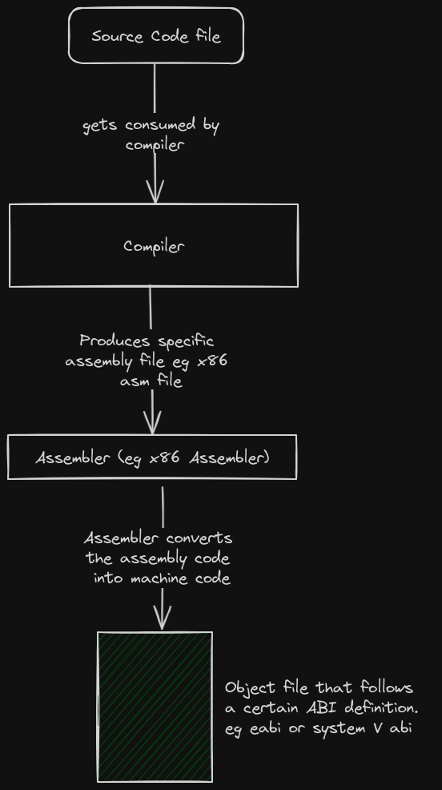

# Cross-Compilation

**Compilation** is the process of converting source code into machine code. ie. converting text into zeroes-and-ones.  

The compilation process for a single file roughly looks like this ...  



When multiple files need to get compiled together, the linker gets introduced : 
  


<br><br><br>


Before we discuss further, make sure you are conversant with the following buzzwords :  
1. [Instruction Set Architecture](../../misc/isa.md) (ISA)
2. [Application Binary Interface](../../misc/abi.md) (ABI)
3. [Application Programming Interface](../../misc/API.md) (API)
4. [An Execution environment](../../misc/execution_environment.md)  
5. The **host machine** is the machine on which you develop and compile your software.  
6. The **target machine** is the machine that runs the compiled sotware. ie the machine that you are compiling for.  


## Target 

If we are compiling program `x` to run on machine `y`, then machine `y` is typically referred to as the `Target`.  

If we compile the hello-world for different targets, we may end up with object files that are completely different from each other in terms of file format and file content.  
This is because the format and contents of the object file are majorly affected by the following factors : 
1. **The CPU Architecture of the target**.  
Each ISA has its own machine code syntax, semantics and encoding. This means that the add_function may be encoded as `001` in ISA `x` and as `011` in ISA `y`. So even if the instructions look identical, the object files end up having a different combination of zeroes and ones.

2. The Vendor-specific implementations on both the software and hardware of the target machine. (undone: this sentence needs further explanations)

3. The **Execution environment** on which the compiled program is supposed to run on. In most cases the Execution environment is usually the OS. The execution environment affects the kind of symbls that get used in the object files. For example, a program that relies on the availability of a full-featured POSIX OS may have more symbols than those found in an object file meant for bare metal.  

4. The [**ABI**](../../misc/abi.md) of the execution environment. Depending on your definition of the ABI, the structure and content of the object file is almost entirely dependent on the ABI. 


To find out how these 4 factors affect the object file, read [here](../../misc/target_factors.md).


So people started describing targets based on the state of the above 4 factors. For example :  

**Target x86_64-unknown-linux-gnu** means that the target machine contains a x86 CPU, the vendor is unknown and inconsequential, the execution environment is an Operating system called Linux, the execution environment can interact with object files ONLY if they follow the GNU-ABI specification.  

**Target riscv32-unknown-none-elf** means that the target machine contains a Riscv32 CPU, the vendor is unknown and inconsequential, the execution environment is nothing but bare metal, the execution environment can interact with object files ONLY if they follow the elf specification.  


People usually call this target specifications **triple targets**...  
Don't let the name fool you, some names contain 2 parameters, others 4 ... others 5. Triple-target does not refer to 3-parameter names.  

The software world has a naming problem...once you notice it, you see it everywhere. For example, what is a toolchain? Is it a combination of the compiler, linker and assembler? Or do we throw in the debugger? or maybe even the IDE? What is an IDE?? Is a text Editor with plugins an IDE?? You see? Madness everywhere!! Naming things is a big problem. 


### Why are triple-target definitions important? - Toolchain Setup
Because they help you in choosing and configuring your compiler, assembler and linker in such a way that allows you to build object files that are compatible with the target.  

For example, if you were planning to compile program `x` for a `x86_64-unknown-linux-gnu` target....
1. You would look for a x86_64 compiler, and install it. A riscv compiler would be useless.  
2. You would look for a x86_64 assembler, and install it. Any other assembler would be useless.  
3. You would then look for system files that were made specifically for the Linux kernel. For example, system files with an implementation of the C standard library such as glibc, newlib and musl. 
4. You would look for a linker that can process and output GNU-ABI-compliant object files
5. You would then write a linker script that references symbols found in the linux-specific system files. That linker script should also outline the layout of an object file that the kernel can load eg Elf-file layout.  
6. You would then configure all these tools and libraries to work together.  

This is a lot of work and stress. Let us call this problem the `toolchain-setup problem`. This is because the word toolchain typically refers to the combination of tools such as the Compiler, linker, assembler, debugger and object-file manipulation tools.  

Rust has a solution to this `toolchain-setup problem`.  


### Enter target specification  

Rust solves the `toolchain-setup problem` by providing a compiler feature called `target specification`. This feature allows you to create object files for any target architeture that you specify. The compiler will automatically take care of choosing a linker, providing a linker script, finding the right system-files and take care of other configurations.  

If you had installed your Rust toolchain in the normal fashion... ie. [using rustup](https://www.rust-lang.org/tools/install), then there is a high chance that your compiler has the ability to produce object files for your machine's triple-target ONLY.  

To see the target-architecture AND triple-target name of your machine, run the following commands :  
```bash
uname --machine  # This outputs your machine's ISA
          # this only works for linux machines. 
          # the author had no idea how to do it in Windows & MacOS. Sorry.

gcc -dumpmachine # This command outputs the triple-target
                 # only works if you have gcc installed
``` 

To see which triple-targets your rust compiler can produce object files for, run the following command :  
```bash
rustup target list --installed   
```


You can make the compiler to acquire the ability to compile for an new additional triple-target by running the command below : 
```bash
# rustup target add <new-triple-target-name>
rustup target add riscv32imc-unknown-none-elf 

# To see the possible triple-target names that could be used in the command above, run this command
rustup target list
```

You can then make the compiler to produce an object file for a specific target using the command below :  
```bash
# cross-compile for any target whose target has already been installed
# The syntax of the command is : 
# cargo build <name_of_your_codebase> --target=<name_of_your_triple_target>

cargo build hello-world --target=riscv32imc-unknown-none-elf  
```  

### Cross-compilation  

Cross-compilation is the act of compiling a program for a target machine whose triple-target specification is different from the triple-target specification of the host machine.   

We achieve cross-compilation in Rust by using the Target-specification compiler feature discussed above.  


### Making cross-compilation easier with cargo  

Example case :  
Assuming that we are compiling a program on a `x86_64-unknown-linux-gnu` host machine and that we intend to run the program on a `riscv32-unknown-none-elf` target machine.  

We could use the command-line like this... 
```bash
cargo build --target=riscv32-unknown-none-elf  
```  
But this would require us to repeat a lengthy command each time we compile our code. To make work easier, we could instruct cargo to always compile for a certain triple-target within our cargo project.  
This is achieved by modifying the .cargo/config.toml file

```bash
# This is the .cargo/config.toml file

[build]
target = riscv32-unknown-none-elf
```  

So each time you want to build the project, you run the usual command ...
```bash
cargo build
```  

Cargo is an awesome tool, learn more about it in the [Cargo Book][cargo-official-book]


## Understanding Cross-compilation
What we have covered in this chapter is "How to cross-compile in Rust".  
The [Rust Toolchain][rust-toolchain-chapter] chapter illustrates how cross-compilation happens behind the scenes in Rust. We discuss LLVM tools and their comparison to GNU tools. We discuss different Rust-compiler back-ends and how you can tweak them.  


[cargo-official-book]: https://doc.rust-lang.org/cargo/
[rust-toolchain-chapter]: ../the_rust_toolchain.md


