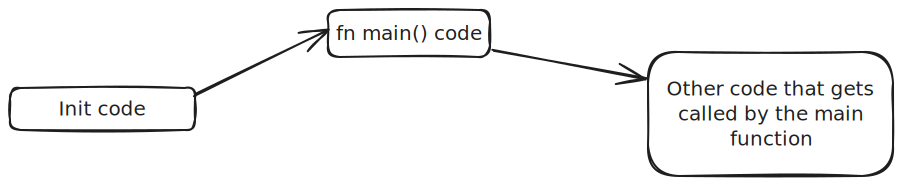

# Pracs 2

At the end of the last sub-chapter, we got the following error : 
```bash 
error: using `fn main` requires the standard library
  |
  = help: use `#![no_main]` to bypass the Rust generated entrypoint and declare a platform specific entrypoint yourself, usually with `#[no_mangle]`
```  

Before we solve it, we need to cover some theory... 


## Rust init code theory
'init code' is the code that gets called before the 'main()' function is called. 'init code' is not a standard name, it is just an informal name, but I hope you catch the meaning here. It is the code that gets executed in preparation for the main function.  



To understand 'init code', we need to understand how programs get loaded. Here we go...  

### Understanding program flow; Machine boot.  
When the power button of a machine(laptop) is pressed, the following events occur (an inaccurate description): 
1. Power flows into the processor. The processor immediately begins the fetch-execute cycle. Exept that the first fetch occurs from the ROM where the firmware is.  

2. So in short, the firmware starts getting executed. The firmware performs a power-on-self test. 

3. The firmware then makes the CPU to start fetching instructions from the ROM section that contains the **loader**. The loader is a program that can copy a program from memory and paste it in the RAM in an orderly way. By orderly way I mean ... it sets up the stack, adds some stack-control code to the RAM, it then loads up the different sections of the program. If the program has [overlays][overlay-explanation-video] - it loads up the code that implements overlay control too.  
Essentially, the loader can paste a program on the RAM in a **complete** way.  

4. The loader loads the Bootloader onto the RAM.  
5. The loader then makes the CPU to point to the RAM section where the Bootloader is situated.  
6. The Bootloader on the other hand starts setting up the RAM sections in preparation for loading the kernel.  
7. The Bootloader then copies the kernel onto the RAM and makes the CPU pointer to point to the entry point of the kernel. An entry-point is the memory address of the first instruction for any program.  
8. The kernel then loads the apps that run on top of it...

**Why are we discussing all these?**  
To show that programs get executed ONLY because : 
1. They were loaded onto either the ROM or the RAM in a **complete** way. The stacks control, overlay-control and other control code routines were also copied onto the RAM together with the actual subject program. The action of copying 'control' code onto the RAM is part of **Setting up the environment** before program execution starts.  

2. The CPU's instruction pointer happened to point to the **entry point** of the loaded program. An entry-point is the memory address of the first instruction for a certain program.  

### Loading a Rust Program
From the previous discussion, it became clear that to properly load a program, you have to setup its environment and identify its entrypoint.  

A typical Rust program that depends on the std library depends on a program called 'crt0' to setup its initial environment. 'crt0' is sometimes called 'the C runtime Zero'. The 'crt0' then transfers control to the 'Rust-runtime'. The rust-runtime does its thing and then it finally calls the usual 'main' function.  

  
This is the **normal entry point chain**. ☝🏼

### CRT0 (C runtime)
So what does the C runtime actually do?  
What does setting up the environment mean?  
What does runtime support mean?  

Read about it [here][the-c-runtime]

### The Rust Runtime
The entry-point of the Rust runtime is marked by the **'start' language item**.  
Rust only has a very minimal runtime, which takes care of some small things such as setting up stack overflow guards or printing a backtrace on panic. The runtime then finally calls the main function.  

## Fixing the Error  

To save you some scrolling time, here is the error we are trying to fix.  
```bash
error: using `fn main` requires the standard library
  |
  = help: use `#![no_main]` to bypass the Rust generated entrypoint and declare a platform specific entrypoint yourself, usually with `#[no_mangle]`
```  

This error occurs because we have not specified the entrypoint chain of our program.  
If we had used the std library, the default entry-point chain could have been chosen automatically ie the entry point could have been assumed to be the 'start' symbol that directly references the Rust runtime entrypoint.  

To tell the Rust compiler that we don’t want to use the normal entry point chain, we add the '#![no_main]' attribute. Here's a demo : 
```rust
#[no_std]
#[no_main]

use core::panic::PanicInfo;

#[panic_handler]
fn default_panic_handler(_info: &PanicInfo) -> !{
    loop { /* magic goes here */ }
}

// main has just been trashed... coz... why not? It's pointless
```

But when we compile this, we get a linking error, something like this ...
```bash
error: linking with `cc` failed: exit status: 1
  |
  # some lines have been hidden here for the sake of presentability...   
 // = note: LC_ALL="C" PATH="/home/k/.rustup/toolchains/nightly-x86_64-unknown-linux-gnu/lib/rustlib/x86_64-unknown-linux-gnu/bin:/home/k/.cargo/bin:/usr/local/sbin:/usr/local/bin:/usr/sbin:/usr/bin:/sbin:/bin:/usr/games:/usr/local/games:/snap/bin" VSLANG="1033" "cc" "-m64" "/tmp/rustcWMxOew/symbols.o" "/home/k/ME/Repos/embedded_tunnel/driver-development-book/driver_code/target/debug/deps/driver_code-4c11dfa3f10db3d0.f20457jvl65bh2w.rcgu.o" "-Wl,--as-needed" "-L" "/home/k/ME/Repos/embedded_tunnel/driver-development-book/driver_code/target/debug/deps" "-L" "/home/k/.rustup/toolchains/nightly-x86_64-unknown-linux-gnu/lib/rustlib/x86_64-unknown-linux-gnu/lib" "-Wl,-Bstatic" "/home/k/.rustup/toolchains/nightly-x86_64-unknown-linux-gnu/lib/rustlib/x86_64-unknown-linux-gnu/lib/librustc_std_workspace_core-9686387289eaa322.rlib" "/home/k/.rustup/toolchains/nightly-x86_64-unknown-linux-gnu/lib/rustlib/x86_64-unknown-linux-gnu/lib/libcore-632ae0f28c5e55ff.rlib" "/home/k/.rustup/toolchains/nightly-x86_64-unknown-linux-gnu/lib/rustlib/x86_64-unknown-linux-gnu/lib/libcompiler_builtins-3166674eacfcf914.rlib" "-Wl,-Bdynamic" "-Wl,--eh-frame-hdr" "-Wl,-z,noexecstack" "-L" "/home/k/.rustup/toolchains/nightly-x86_64-unknown-linux-gnu/lib/rustlib/x86_64-unknown-linux-gnu/lib" "-o" "/home/k/ME/Repos/embedded_tunnel/driver-development-book/driver_code/target/debug/deps/driver_code-4c11dfa3f10db3d0" "-Wl,--gc-sections" "-pie" "-Wl,-z,relro,-z,now" "-nodefaultlibs"
  = note: /usr/bin/ld: /usr/lib/gcc/x86_64-linux-gnu/11/../../../x86_64-linux-gnu/Scrt1.o: in function `_start':
          (.text+0x1b): undefined reference to `main'
          /usr/bin/ld: (.text+0x21): undefined reference to `__libc_start_main'
          collect2: error: ld returned 1 exit status
          
  = note: some `extern` functions couldn't be found; some native libraries may need to be installed or have their path specified
  = note: use the `-l` flag to specify native libraries to link
  = note: use the `cargo:rustc-link-lib` directive to specify the native libraries to link with Cargo (see https://doc.rust-lang.org/cargo/reference/build-scripts.html#cargorustc-link-libkindname)
```

This error occurs because the toolchain thinks that we are compiling for our host machine... which in this case happens to be a x86_64-unknown-linux-gnu machine.  


To fix this error, we execute one of the following solutions :
1. Specify a cargo-build for a triple target that has 'none' in its OS description. eg `riscv32i-unknown-none-elf`. This is the easier of the two solutions, and it is the most flexible.  
2. Supply a new linker script that defines our custom entry-point and section layout. If this method is used, the build process will still treat the host's triple-target as the compilation target.   

If the above 2 paragraphs made complete sense to you, and you were even able to implement them, skip to the [Debugging chapter]() <!-- undone: provide link -->  


If they did not make sense, then you got some reading to do in the next immediate chapters... `Cross compilation and linking`.  
Don't worry, we will get to a point where our bare-metal code will run without a hitch... but it's a long way to go. And its fun. Rainbows, uniorns and excalibars everywhere!!  


[overlay-explanation-video]: https://www.youtube.com/watch?v=lWVQsld8hMI
[the-c-runtime]: /src/misc/the_C_runtime.md   
<!-- undone : explain the C runtime in more detail -->
