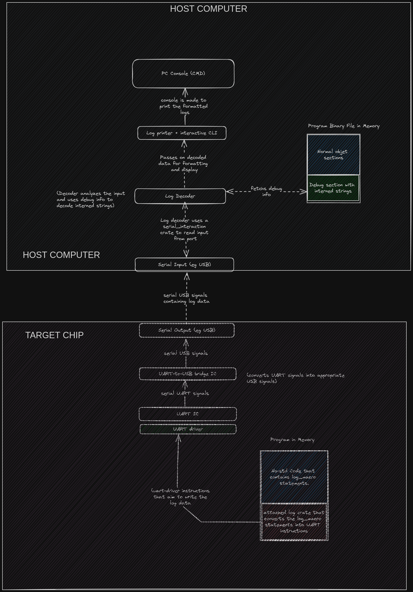

# draft_1

This page explains how we are going to achieve logging in our setup.  

## Typical logging architecture  

So how does logging happen? How is the log data encoded? How is the data transmitted? How does the host machine receive and display the log data?  

Here is a rough architecture....  

  

Well... there's a lot to unpack here.  

