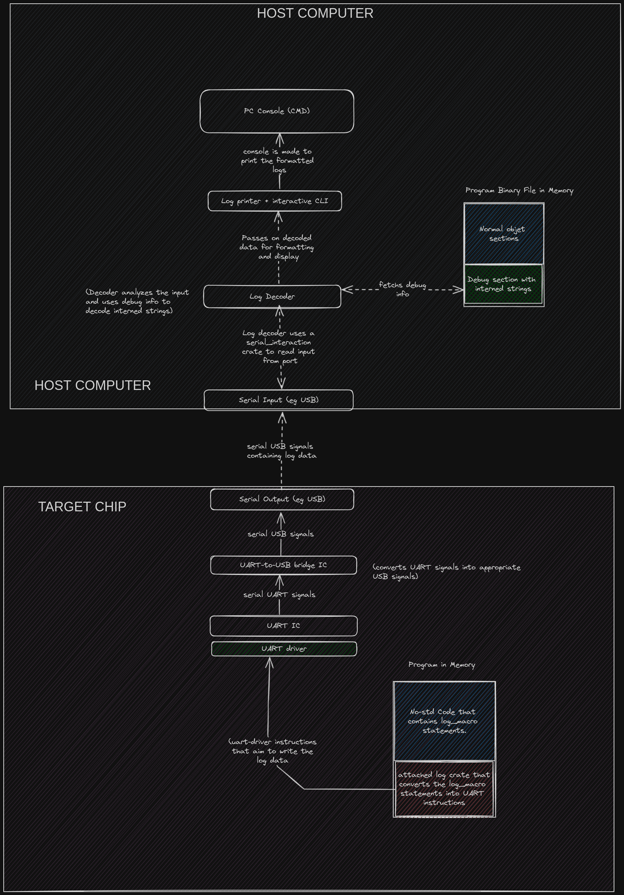

# draft_1

<!-- undone : Explain this topic well, in a procedural manner. This topic does not have readable flow -->

This page elaborates on the logging architecture.  

## Typical logging architecture  

So how does logging happen? How is the log data encoded? How is the data transmitted? How does the host machine receive and display the log data?  

Here is a rough architecture....  

  

Well... there's a lot to unpack here.  

### Explanations Based on the Image above

Our aim is to :  
1. Allow the programmer to embed logging 'print' statements in the code
2. Make the no-std program have the ability to pass on those log statements to the Serial output of the target chip
3. Make the host CPU receive those log statements and display them.
4. (optional) provide an interactive CLI app to help the end-user to engage with the data in an interactive manner.  

### Pre-runtime flow of events  

The programmer embeds log_print macros in their code where necessary. And then they compile it.  
For example :  

```rust
// no_std module
fn _start () {
    // bla bla bla
    log::info!("program has finished bla-bla-ing");
     
    if some_variable == true {
        // ble ble ble
        log::warn!("program has done ble-ble-ble");
    }
    else {
        // bli bli bli
        log::error!("program just did bli-bli-bli, that's an error, deal with it");
    }
}
```

During the compilation process, the compiler expands the log_macros seen above in accordance to the log_crate that the programmer is using. So a line like `log::info!("program has finished bla-bla-ing");` will expand to something like :  
```rust
  // code block filled with pseudo-code
  {
    // this code cotains instructions that can indirectly manipulate UART registers
    // It could even be written in assembly, if you want finer control over how the log-info gets to be passed. 
    let uart_instance = acquire_uart();
    uart_instance.uart_write_string ("program has finished bla-bla-ing");
    uart_instance.flush();

  }
```  

Point being, the `log macros` expand into code that can interact with the serial outout of the SoC. In this case, the macros expand to code that can interact with the UART.  

<br><br>

During that same compilation process, the indices of the **interned strings** get embued as part of the debug section in the final object file.  
So what are **interned strings?**.  

Well... the micro-controller has limited memory. We would not like to burden it with the responsibility of storing log_strings. We would not like to make the log_strings part of the binary file that gets loaded onto the MCUs memory.  
So people found a way to *compress* the strings. This string compression consists of building a table of string literals, like "program has finished bla-bla-ing" or "The answer is {:?}", at compile time. At runtime, this table is made accessible for the host machine to view. On the other hand, the target machine sends indices instead of complete strings.  

So instead of storing complete strings in the MCU's memory, we store them in the host's memory. The MCU only stores string indices (string IDs).  
On top of sparing the MCUs memory, this technique increases the logging throughput; the MCU can use a single byte to convey an entire 256-byte string.  

In summary, **Interned strings** are the strings that get indexed in the compression process. Log crates usually store them as debug info in the program's object file.  


### Runtime flow of events  

These are the events that happen during the actual logging.  
Here are the assumption is that...  
1. The program is already running in the MCU
2. The debug info has been loaded in the host machine.  
3. There is a decoder, and printer installed on the host machine.  


From the above image...  
The log_print macros found in the no_std app get executed by the processor of the SoC.  
And since those code snippets contain code that manipulates the UART driver, they get used to transmit the indices of the interned strings to the UART.  
The data that gets transferred to the UART is [*unformatted*](#unformatted-data) .   

With the assumption that the HOST machine has USB ports only, we are forced to use a UART-to-USB integrated circuit to convert the UART signals into USB-compatible signals.  

The SoC's USB transfers the data to the host's serial input(another USB).  

**The decoder**  

The decoder is a program that decodes the indices in the received data. 
The log data received from the SoC contains indices that reference actual strings found in the debug section of the target object file.  
The decoder's work is to fetche the respective interned strings from the debug section and resolve/expand all the indices.  
The decoder then outputs the complete AND unformatted logs.  


**The Printer**  

The printer is a program that ...
- Takes in unformatted logs and formmats them
- Interacts with the host's console in order to output the logs in a presentable way (tables, buttons, percentages... basically a UI)

Both the decoder and the printer can be custom-made crates or established third-party software. The choice is up to you.  


#### Unformatted data?  

*What is formatting in general?*  

Formatting is the process of converting raw data into another form that is presentable.  
For example, you can format a struct to be a string  
```rust
// this is pseudo, no syntax rules have been observed
struct Time {
    year : 2024,
    month : "January",
    date : ...
    hr... 
    min...
}


fn format ( input: &Time) -> String{
    // outputs a string like ...
    //  "25th January 2024 at 0800hrs"
}
```  

So you can say, "the struct `Time` can be formatted into a string.  


*What is formatting in the logging context?*  

Formatting in the logging context involves ...
1. Converting raw binary data into strings.  
2. Implementing the format styles of respective data.  


For example :  
```bash
# Here is a conversion of raw data into strings
`255u8` gets converted into into "255"  

# Here is an implementtion of formatting styles
log::info!("{=u8:#x}", 42); will be formatted to the string "0x2a"
log::info!("{=u8:b}", 42);  will be formatted to the string "101010"
```

The logging data coming out of the SoC is usually unformatted so as to spare the MCU's processor from having to do the conversion/formatting. All the heavy-lifting is made to be the host's resposibility.  

