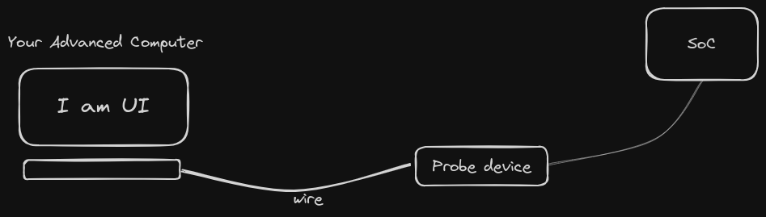
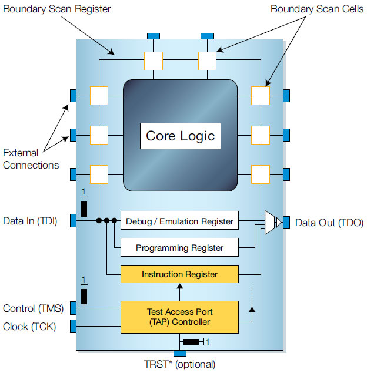
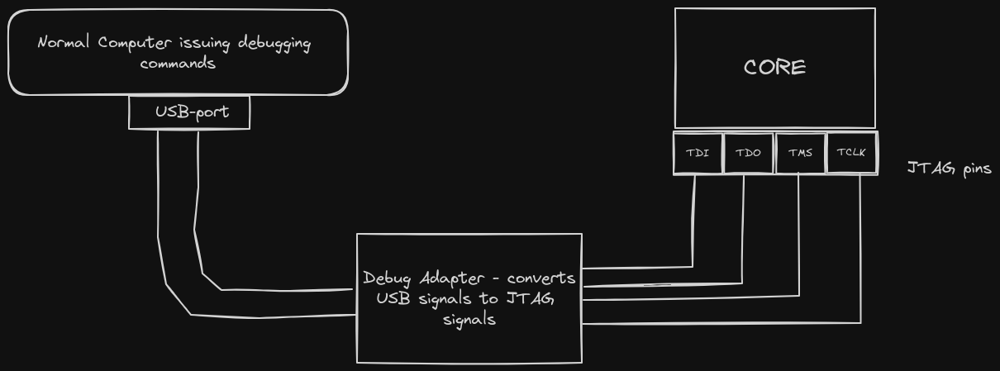

# Probing Theory Part 1

What is probing really? How is it achieved? What's flashing? What's in-system programming? Debugging?  

## Probing
Probing is the act of interacting with a microcontroller... or a device that does not have a comprehensive User Interface.  

Interacting may mean one of the following :  
 
1. **In-system programming** - this is the process of accessing the RAM and ROM of components in the SoC in such a way that you can change the firmware code.  
2. **Monitoring** - this is the act of fetching data on the events happening in the SoC for the sake of maybe debugging.  
3. **Flashing** - Flashing is a fancy name for : "using in-system programming to wipe out all the current firmware in the memory and replacing them with fresh new lines"
4. **SoC testing** (eg boundary scan testing) - this is the act of testing whether the circuitry of the SoC works as expected.  

## How are probing devices able to interact with a chip? 

"A probing device is able to interact with a chip because the probe device interfaces with the boundary-scan interface present on the chip."  

An SoC is made up of circuits. To test whether the circuits worked as exected, the designers of the past used to use [test fixtures][test-fixtures] but with time they settled for using on-chip test circuits.  
An popular and standard example of on-chip test circuitry is the [Boundary-scan][what-is-a-boundary-scan].  

With time, it became clear that boundary scans could control and affect how the SoCs worked if connected properly. They could even be used to read and write to the RAM and ROM if attached to the DMA controller. They could be used to monitor the signals coming in and out of the Core. They could be used to inject stub data to the pins of the core and thus manipulate the core itself... Boundary-scans became the holy-grail of monitoring and manipulating SoCs.  

With time people came up with boundary scan standards that roughly specified : 
- How the circuitry was hooked up. 
- How the physical interface between the scan and external probes was to b implemented. 
- The communication protocol between the scan and external probes.

One open and stadardized boundary scan is called the JTAG standard.  
There is also another proprietary on-chip test circuitry called SWD.  

All this info might not make sense on the go...    
Go watch this [video by EEVBlog][jtag-video-by-EEVBlog], it puts things into persective.  

After that [video][jtag-video-by-EEVBlog], you might want to get your definitions and structures right by reading a more [formal but simple technical guide][jtag-technical-guide] by the xjtag organization.  

By the end of all that reading and video-watching, the figure below should make total sense... in fact, you should be very very mad because it misses out on some important components :  

## The Probe/ Debug Adapter

From here on, the term JTAG will be used a synonym for Boundary-scan-circuit.  

The probe/debug adapter is the physical device that connects a normal computer to the JTAG interface. This is because the JTAG interface is not directly compatible to the ports found on a normal computer. For example the USB port found on a computer cannot directly connect to the 4 pins of the JTAG port.  

## Open-OCD and its alternatives
So how does the host computer know which signals to send to the Debug adapter?  

There is a program called OpenOCD. OpenOCD is a software abstraction of the JTAG protocol. This software program consumes high-level debug commands and outputs JTAG-level commands through the USB port.  

From there, the drivers found in the debug adapter convert those USB-wrapped-JTAG-electrical signals into a 4-split output as shown below :  

There are many alternatives to OpenOCD... eg Probe-rs and SJLink. OpenOCD was used here just because it is a popular and battle-tested software. So whenever we mention OpenOCD, we are indirectly referring to all the JTAG-protocol software implementations; it is inaccurate but convenient.    

Just to clarify, the high level commands that get consumed by OpenOCD do not necessarily have to come from the GDB debugger, they can come from any software that can interface with the API. For example 'flashing programs' and 'Monitoring programs' can also apply here... even well interfaced bash scripts are allowed!

## GDB and its alternatives

GDB (GNU Debugger) is a debugging software that has a well defined debugging protocol. There are many other debugging software and corresponding protocols... but we'll stick to GDB because it is has great support, well documented and it has many functionalities. It is battle-tested.  

There are three modules of the GDB that are worth noting here : 
1. The GDB main application (mostly a CLI, but there are GUI implementions too)
2. The gdb server
3. The gdb stub

**The GDB CLI** is the core application, the engine. It is interactive and complete.  

**The gdb server** is a proxy between GDB CLI and other applications. Its main roles are :  
- Listening & Receiving data/instructions from the GDB CLI
- Listening & Receiving data/instructions from the application that has been interfaced to the GDB CLI
- Passing on received data to the opposite end of the channel.  

**The gdb stub** the gdb stub has two meanings depending on the context. And before we define the meanings, we'll take a detour to understand a tiny part of how a debugger works.  

### The Detour: How a debugger works  
Suppose you are debugging program `x` on your linux machine... the debub program and program `x` will run as two seperate processes.  

**Debugging Information:**  
When you compile a program with debugging information enabled, the compiler includes additional metadata in the executable binary. This metadata provides GDB with information about the source code, such as variable names, line numbers, function names, and the layout of the program's memory.  

**Launching the Program:**  
To debug a program with GDB, you typically start GDB and specify the executable binary of the program as an argument.  
GDB loads the executable binary into memory (RAM) and prepares it for debugging. It also reads the debugging information embedded in the binary to understand the structure of the program.  

**Injecting extra code**  
When you set debugging breakpoints, what GDB actually does is to insert 'control code' in the process x's RAM text section. Same case to the `continue` gdb instruction.  

During execution, the program's code resides in memory, where it can be modified by the debugger for debugging purposes. This modification is temporary and does not alter the original program file on disk.  

When GDB inserts a breakpoint or other debugging instruction, it's modifying the program's code in memory, not the original source code file. This modification allows the debugger to interrupt the program's execution at specific points and provide debugging information to the user without permanently altering the program itself.

### Back from the Detour: Defining gdb stub
In the normal debugging context (i.e in a non-embedded environment), the word gdb stub means 'a file that contains the implementations of the control code that usually gets injected by the debugger into the process' memory.   

You can learn more about this from the [official gdb docs on stubs][gdb-stub-functions]

In the embedded context, the gdb stub is a piece of firmware that implements the 'control code' that gets inserted in the process' memory. It also contains an implementation of code that allows it to communicate to the gdb server. This GDB stub is usually found on the target machine or the debub probe.  

GDB stubs are commonly used in embedded systems for facilitating communication between the target device and the debugger.  

<!--  undone

## Summary Picture  
 draw a summary picture that shows the relations between : 
 - host computer
 - target SoC
 - Debug Adapter
 - openOCD
 - GDB cli, gdb server, gdb stub
 - jtag interface
 - jtag TAP
 - core
 - memories (RAM + ROM) -->

[test-fixtures]: https://en.wikipedia.org/wiki/Test_fixture  
[what-is-a-boundary-scan]: https://www.youtube.com/watch?v=Y_dfg8h_yEY
[jtag-video-by-EEVBlog]: https://www.youtube.com/watch?v=TlWlLeC5BUs
[jtag-technical-guide]: https://www.xjtag.com/about-jtag/jtag-a-technical-overview/
[gdb-stub-functions]: https://ftp.gnu.org/old-gnu/Manuals/gdb/html_node/gdb_126.html