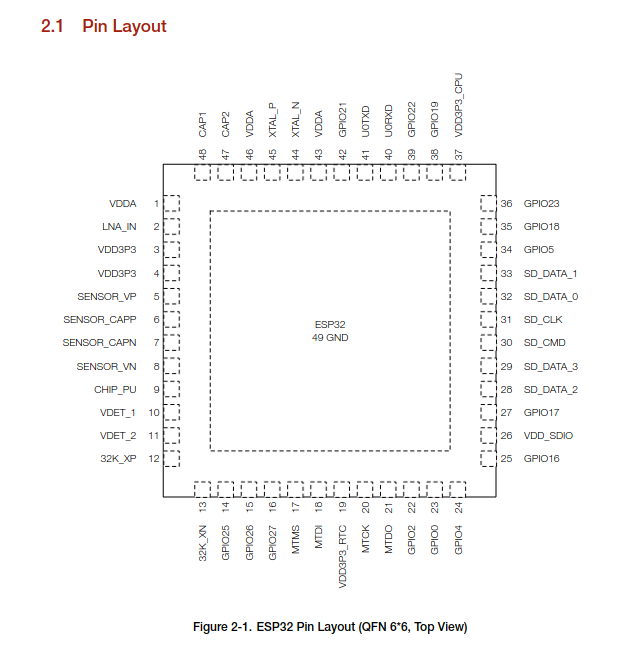
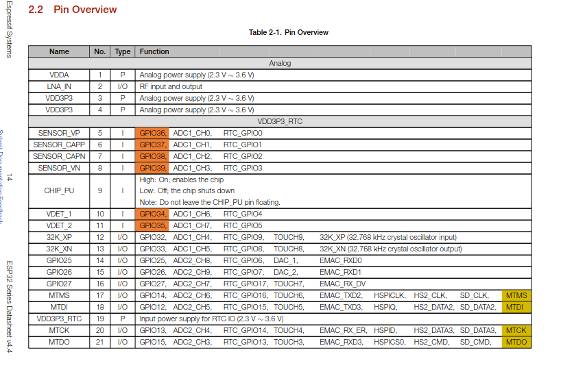
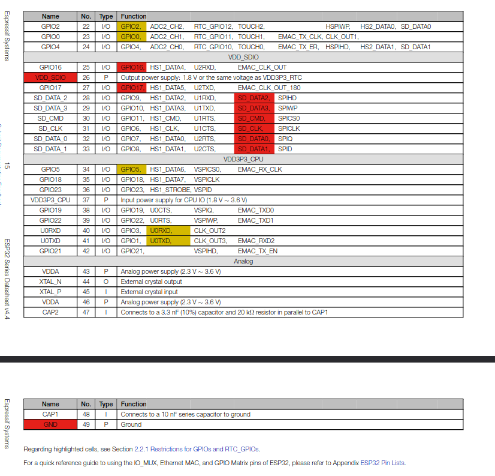
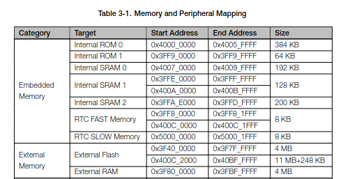
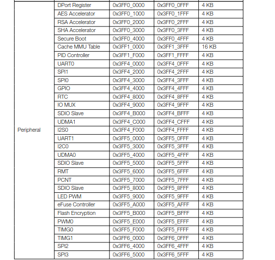
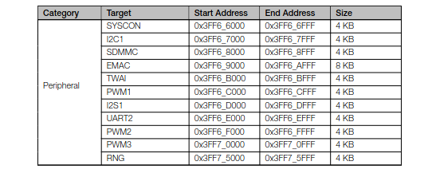

# Knowing your Hardware

Your hardware is like a library, to use it correctly, you should know it well... or at least know the relevant parts.  
To understand your hardware, you read the datasheet. Like this one : the [esp32 datasheet](https://www.espressif.com/sites/default/files/documentation/esp32_datasheet_en.pdf)  

The 20% of the 100%, the important parts :  

- Understand the functional features and capabilities 
- Understand the hardware registers AND pins of the hardware you want to control.  

What's the diference between  pin and a register in mmio?  [Demo, undone]

### Figures

1. Physical board with Pins
   

2. Pin Layout
   
   

3. Memory Layout (Registers + Actual_memory)
   
   
   

