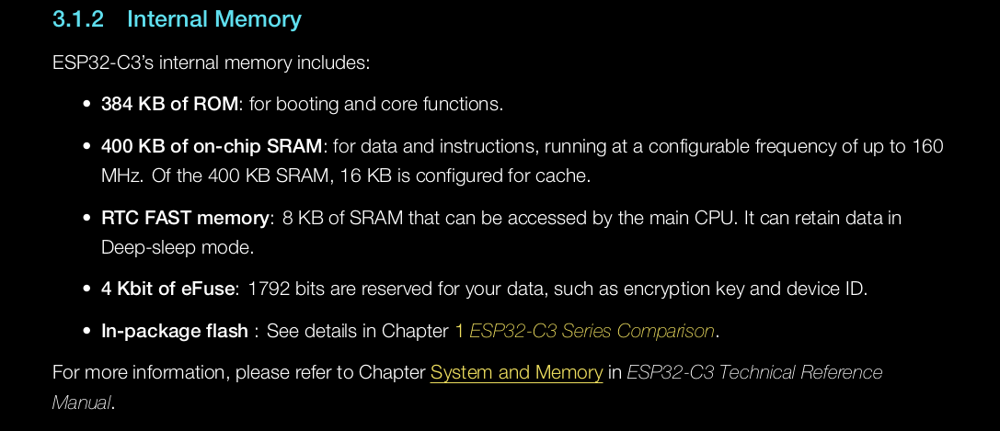
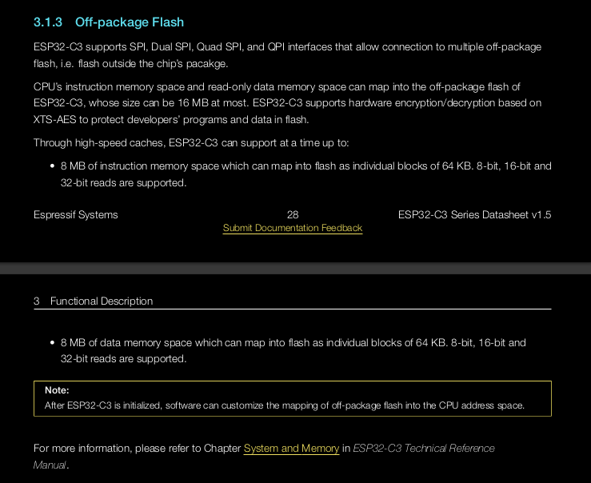
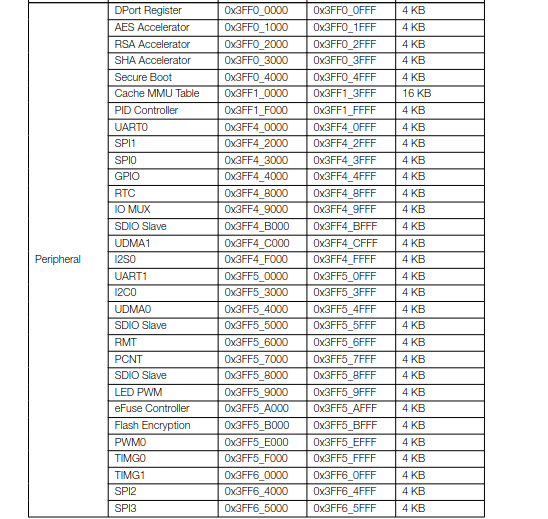
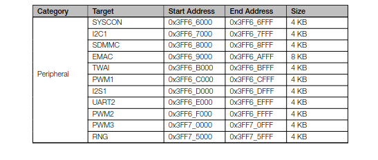
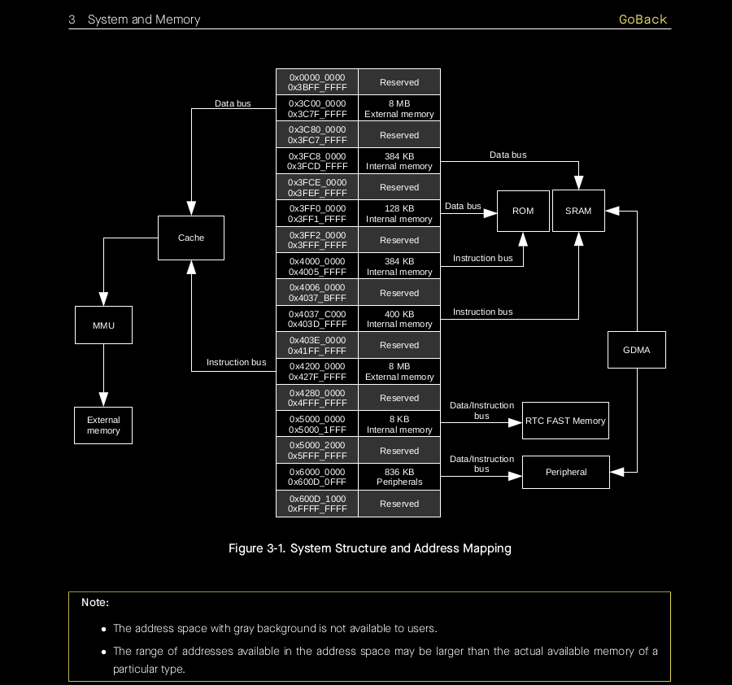
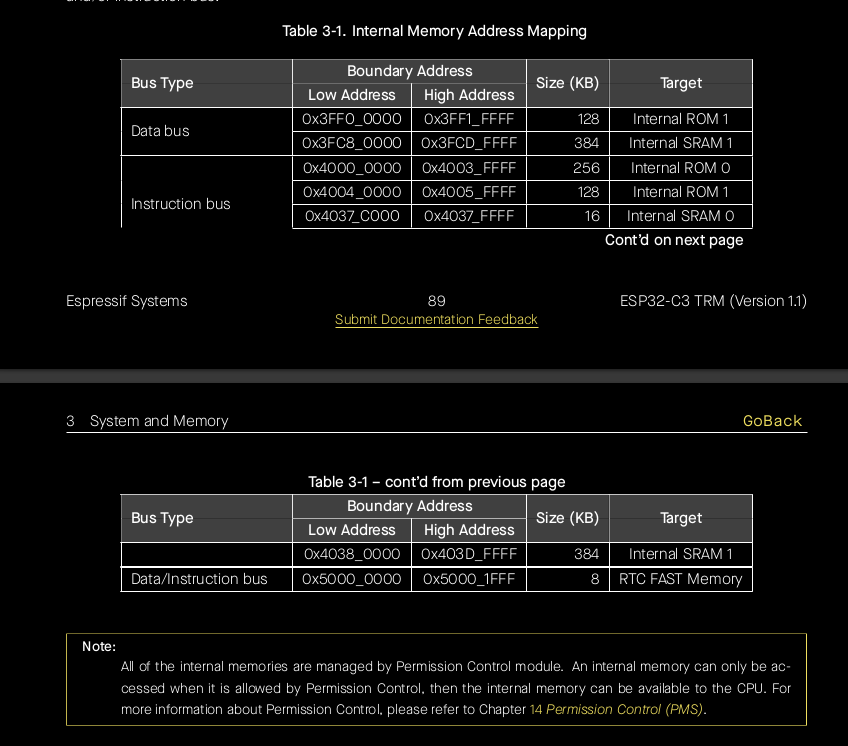

# Step one : understanding the memory layout of the board

We need to know the memory layout of the board. 
 - Where is the address of the RAM? 
 - Where's the ROM address?. 
 - Which sections do we need to load into?  
 - Which sections do we need to AVOID overwriting?
 - Which sections are unusable?
 - Are there sections that have hardwired access-permissions?

We want to know how and where we will load the object file.  
So we read the 'System Memory chapter' from both the datasheet AND Technical_reference. Don't fret, all of this is like 20 pages, and most of the pages just have images.  

Below are some useful excerpts from the datasheet.  

## Memory Descriptions : 

More elaborate memory descriptions are found in the technical reference (2 pages long)

## Memory Mappings :  

## Visual Representation of memory mapping :

You may notice that some info looks contradicting. For example, the docs said that the chip has 384kiB of ROM yet in the images we have ROM-0 and ROM-1. ROM-0 is 384kiB and ROM-1 is 64kiB, that totals to 448kiB!! We expected 384KiB but we got 448KiB. This 'contradiction' has been explained below.   

## Buses and the addres space
The address space is the list of addresses that the CPU can process/access. If you want to access addresses beyond the address space, you have to modify the CPU itself. 
Since the CPU bus is 32bits long, it can access a 4GiB memory address space in a one-to-one access ie without the help of MMUs to help it access more than 4GiB.   

The CPU has 2 kinds of buses, data buses and instruction buses. This was a design choice, I guess for the sake of performance. Separating concerns breeds specialization. 

Both data bus and instruction bus are little-endian.  

The data bus can access memory using single-byte, double-byte, 4-byte alignment. The instruction bus can only access memory using a 4-byte alignment. That means that you can fetch a 64-bit word even if what you really intended to fetch was a byte. Choose your trade-offs well.  

There are sections of memory where only the instruction bus can access. They are shown in the table below.  

Now, going back to our earlier contradiction. It is not really a contradiction, the ROM is 384 kiB But it is divided into 2 parts that overlap. ROM-0 is 384kiB and can be accessed by the instruction bus ONLY. ROM-1 is a subset of ROM-0. ROM-1 is 64kiB out of the entire 384kiB. ROM-1 can be accessed by both the Data bus and instruction bus.  

Now, if I say that the ROM-1 and ROM-0 overlap, why do they have different and distinct addresses?  
As earlier said, some sections can be accessed by both the data and instruction bus. So even if the addresses used are different, they are referring to the same physical point. The different addresses help the CPU know which bus you have chosen to use.  

