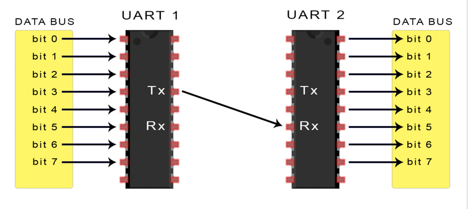
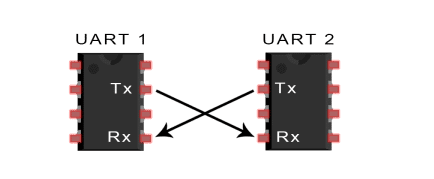
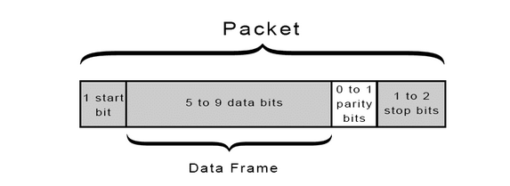

# General Overview

## What is the UART?  
Before tackling the meaning of UART, let's get some acronyms out of the way.  
- UART stands for `Universal Asynchronous Receiver/Transmitter`.  
- *Tx* stands for `Transmitter`.  
- *Rx* stands for `Receiver`.  

We're done with the acronymns, now we are on the same jargon wavelength.  

The UART is an integrated circuit that takes in parallel data from one end and outputs serial data on the other end. It also receives serial data from one end and outputs parallel data on the other end.   
So you can say that it is a *parallel-to-serial converter with a few extra steps*.  

If you connect two UARTs as seen below, you achieve serial communication between two devices that have parallel data buses.  

  

**What does asynchronous mean in this case?**  
"Asynchronous" refers to the method by which data is transmitted and received between two independent devices without requiring a shared clock signal between the transmitting and receiving devices.  
Instead of using a clock to synchronize the rate at rate at which bits are exchanged, the two communicating devices agree on the data-packet format and the rate of transmitting the bits of that data-packet.  

The rate at which the bits of the data-packet are transmitted is referred to as `baud rate` in this context.  

### So is UART a serial-communication protocol?  
Well... The UART is not a communication protocol itself but rather a hardware component or module that facilitates serial communication between devices. You could say that it is circuitry that serves as the underlying hardware mechanism for implementing various communication protocols such as RS-232, RS-485, MIDI, and others  

Confusing... right? ha ha.  

UART == circuit.  
UART != protocol.  
You can implement asynchronous protocols using a UART circuitry. 

## How the UARTs work. 

In UART communication, two UARTs communicate directly with each other. The transmitting UART converts parallel data from a controlling device like a CPU into serial form, transmits it in serial to the receiving UART, which then converts the serial data back into parallel data for the receiving device.  
Only two wires are needed to transmit data between two UARTs. Data flows from the Tx pin of the transmitting UART to the Rx pin of the receiving UART:  

  

UARTs transmit data asynchronously, which means there is no clock signal to synchronize the output of bits from the transmitting UART to the sampling of bits by the receiving UART. Instead of a clock signal, the transmitting UART adds start and stop bits to the data packet being transferred. These bits define the beginning and end of the data packet so the receiving UART knows when to start reading the bits.

When the receiving UART detects a start bit, it starts to read the incoming bits at a specific frequency known as the baud rate (bits per second). Both UARTs must operate at about the same baud rate. The baud rate between the transmitting and receiving UARTs can only differ by about 10% before the timing of bits gets too far off.  

So before any data transfer actually happens, the two UARTs must agree on : 
1. The Data packet format
2. The Baud rate (bps)

**Example Case :**  

  

The UART that is going to transmit data receives the data from a data bus. The data bus is used to send data to the UART by another device like a CPU, memory, or microcontroller. Data is transferred from the data bus to the transmitting UART in parallel form.  
After the transmitting UART gets the parallel data from the data bus, it adds a start bit, a parity bit, and a stop bit, creating the data packet.  
Next, the data packet is output serially, bit by bit at the Tx pin. The receiving UART reads the data packet bit by bit at its Rx pin. The receiving UART then converts the data back into parallel form and removes the start bit, parity bit, and stop bits. Finally, the receiving UART transfers the data packet in parallel to the data bus on the receiving end.  
 

**If the communication between the two is asynchronous, how do they agree with each other in the first place?**  

1. **Manual Configuration**: In many systems, the baud rate is manually configured by the user or system designer. This involves setting the baud rate to a specific value (e.g., 9600 bps, 115200 bps) on both the transmitting and receiving UARTs. The configuration is typically done through software or hardware settings.

2. **Default Baud Rate:** In some cases, UART devices may have default baud rate settings. If both devices are configured to use the same default baud rate, no additional configuration is necessary.

3. **Negotiation**: In more advanced systems, UART devices may support auto-baud detection or negotiation protocols. Auto-baud detection allows a UART receiver to automatically determine the baud rate of incoming data by analyzing the timing of the start bits. This can be useful when the baud rate is not known in advance or may vary.

4. **Hardware Handshaking**: In certain situations, UART communication may also involve hardware handshaking signals (such as RTS/CTS - Request to Send/Clear to Send) to coordinate communication between devices. These signals can help ensure that data is only transmitted when the receiving device is ready to receive it, reducing the risk of data loss or corruption.  
  

### The UART data packet

The format of the data packet needs to be agreed upon by the two communicating UART circuits as earlier mentioned.  

The format is typically structured as follows....

- **Start Bit**: The start bit signals the beginning of the data byte. It is always set to a low voltage level (logic 0). The duration of the start bit is one bit duration, determined by the baud rate.  

The UART data transmission line is normally held at a high voltage level when it’s not transmitting data. To start the transfer of data, the transmitting UART pulls the transmission line from high to low for one clock cycle. When the receiving UART detects the high to low voltage transition, it begins reading the bits in the data frame at the frequency of the baud rate.  

- **Data Bits**: These are the actual bits representing the data being transmitted.  
The number of data bits can vary, but common configurations include 7 or 8 bits per data byte. It can be 5 bits up to 8 bits long if a parity bit is used. If no parity bit is used, the data frame can be 9 bits long.  

The data bits are typically transmitted LSB (Least Significant Bit) first. The duration of each data bit is determined by the baud rate.

- **Parity Bit (Optional)**: The parity bit, if used, is an additional bit for error detection. It can be set to even parity, odd parity, mark parity, space parity, or no parity (none).  

Parity describes the evenness or oddness of a number. The parity bit is a way for the receiving UART to tell if any data has changed during transmission. Bits can be changed by electromagnetic radiation, mismatched baud rates, or long distance data transfers. After the receiving UART reads the data frame, it counts the number of bits with a value of 1 and checks if the total is an even or odd number. If the parity bit is a 0 (even parity), the 1 bits in the data frame should total to an even number. If the parity bit is a 1 (odd parity), the 1 bits in the data frame should total to an odd number. When the parity bit matches the data, the UART knows that the transmission was free of errors. But if the parity bit is a 0, and the total is odd; or the parity bit is a 1, and the total is even, the UART knows that bits in the data frame have changed.

- **Stop Bit(s)**: The stop bit(s) signal the end of the data byte. Typically, one or two stop bits are used. The stop bit(s) are set to a high voltage level (logic 1). The duration of each stop bit is determined by the baud rate.

### Advantages of using UARTs

- Simple, Only uses two wires
- Simple, No clock signal is necessary.
- Has a parity bit to allow for error checking
- It can accomodate custom communication protocols; The structure of the data packet can be changed as long as both sides are set up for it
- Well documented and widely used method

### Disadvantages of using UARTs

- The size of the data frame is limited to a maximum of 9 bits.In scenarios where larger data sizes need to be transmitted, the limitation to 9 bits per frame can result in inefficiencies. It may require breaking down larger data sets into multiple frames, which can increase overhead and decrease overall efficiency.
- Doesn’t support multiple slave or multiple master systems
- The baud rates of each UART must be within 10% of each other

### Clarifications
As seen from the image at the top of the page, the connection uses two wires to transmit data between devices. But in practice, you may use 3 wires for each device. For example, the 3 wires attached to UART 1 will be : 
- The Transmitter wire (Tx wire) from UART 1 to UART 2
- The Receiver wire (RX) from UART 2 to UART 1
- The Ground wire

### credits and references
- Credits go to this [circuitbasics blog][reference-blog-one], for the images and elaborate content. You can give it a read.    
- If you want to learn about the different serial communication protocols associated with the UART, this [Raveon technical brief][raveon-technical-brief] provides a short overview

[reference-blog-one]: https://www.circuitbasics.com/basics-uart-communication/  
[raveon-technical-brief]: https://www.raveon.com/wp-content/uploads/2019/01/AN236SerialComm.pdf