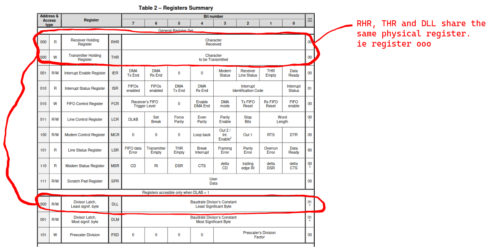
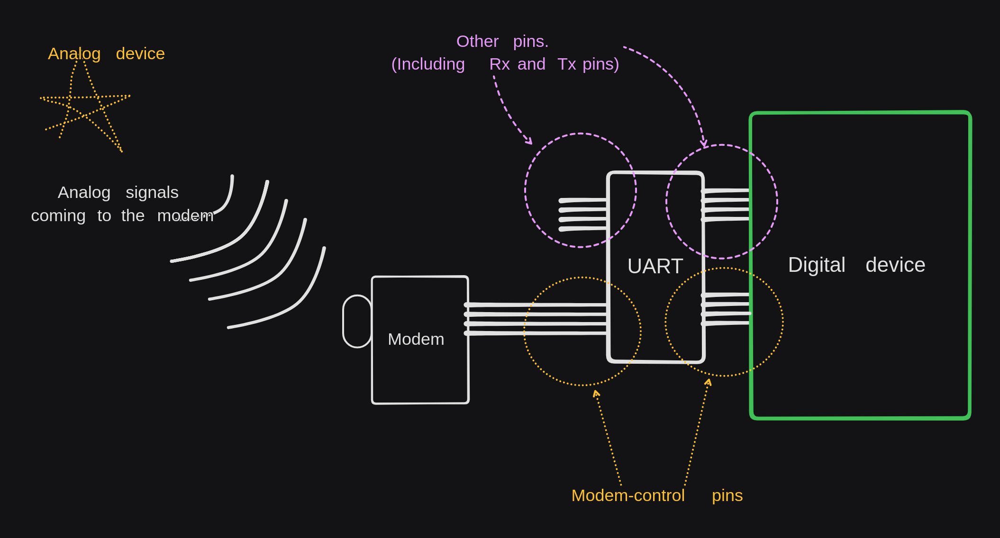
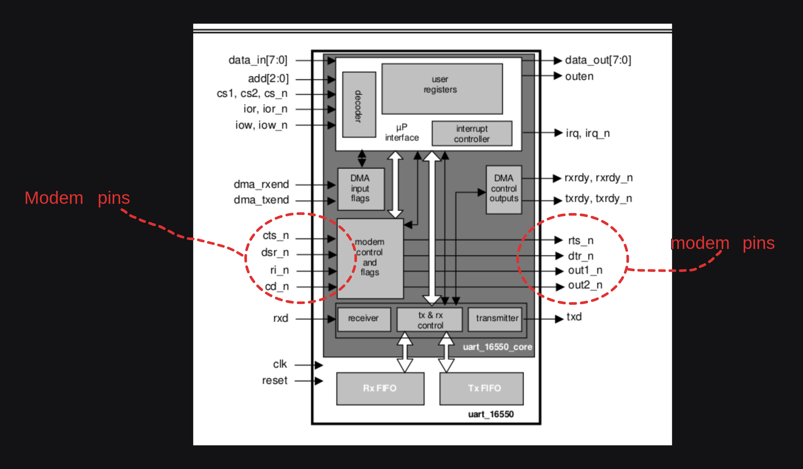

# UART Registers  

There are many UART designs and implementations each with different tweaks. So we will stick to the NS16550a UART because it is the one that the Qemu-riscv-virt machine emulates.  

NS16550a UART is also kinda generic. It is an old design, but very simple. It gets the job done without clutter.  
The NS16550a also has two 16-byte FIFO buffers for input and output  

If you want to check out the other different designs and implementations, go through this [table][other_uart_designs_and_implementations].  

## References and Docs
Here are a few guiding docs that will help you learn more about the UART registers and configs.  
1. [A blog-like explanation by Lammert Bies][simple-uart-blog] (start with this, it explains the most important bits without the electrical-engineering jargon)
2. [The 16550A datasheet][the-16550A-datasheet] (use this as a reference. It comes with electrical-references that wil come in handy if you are writing a driver for a physical UART)


## UART Registers
The UART circuit gets manipulated through a set of registers.  
This chapter is meant to describe each of those registers.  
You do not have to memorize each register, just know that they exist. This chapter is best used as a reference-chapter instead of a prose-chapter.  

The UART has 12 virtual registers built on top of 8 physical registers. This might sound confusing but it actually makes sense. This is because a physical register can be used differently under different contexts. For example, the first Register can be used as a logical write-buffer register when the user is writing to the UART, but when the UART is reading from the same register, it will be treated as a logical read-buffer register.  

Below is a diagramatic representation of the 12 UART registers :    
  


Notice that there are registers that share the same physical space. For example.... see below   
  

To understand the functionalities of each register, it's better to first understand the operations that they all try to achieve in unison.  
So here are the operations that all registers try to achieve as a whole...
1. Setting the Baud rate during configuration
2. Modem control
3. FIFO ontrol
4. Interrupt handling

### 1. Setting the baud-rate
The baud_rate is the rate at which bits are received or transmitted. It is measured in Bits per second (bps).  
The baud_rate needs to be set before data starts being set.  
The maximum_baud_rate is the maximum rate at which bits can be sent or received. If we transmitted data at maximum baud rate, there is a high chance that buffer-overuns would occur.  

The actual baud rate is less than the maximum baud rate. The actual baud rate is found by dividing the maximum baud-rate by a number of your choosing. ie.  
```bash
# The NS16550a was designed such that each bit transmitted was given a duty-cycle of 16 clock ticks.  
# The `clock_frequency` is the measure of 'how many ticks happen per unit time'. So the clock_frequency can be measured as 'ticks per second'. From here on, we will assume that the clock_frequency is measured as `ticks per second` 

# To calculate how many UART_bits can be transmitted per second under a certain clock frequency, we do...
maximum_achievable_baud_rate = (Clock_frequency / 16) 

# To avoid buffer overruns, we avoid using the maximum_baud_rate and instead reduce its value.  
actual_baud_rate = (maximum_achievable_baud_rate / any_chosen_number)  # The division here is just so that we can get a lower value than the maximum baud rate

any_chosen_number = (value_found_in_divisor_register) * (value_found_in_prescaler_register)
```  

It is up to the driver programmer to specify code that will help in settig the baud_rate.  

### 2. FIFO control  
It is up to the driver programmer to provide a way to :  
- enable and disable FIFO buffer usage
- Read and Write to the FIFO buffers in an error-free way

This passage has been borrowed from the data-sheet : 

"The holding registers of both the transmitter (THR) and the receiver (RHR) can be formed by a unique 1-word register or by a 16-word First-In-First-Out (FIFO) buffer. At synthesis time the designer can select whether to implement or not the FIFOs (both at the same time, it is not possible to have a FIFO in one direction and a simple register in the opposite direction). If they are implemented, by software they can be enabled or disabled. When the FIFOs are disabled, the behavior is the same as if they had not been implemented. The UART working without FIFOs is what is commonly called the 16450 mode, due to the name of the industry standard UART without FIFOs. The FIFOs are enabled or disabled using the Fifo Control Register (FCR). It is possible to know if an UART has the FIFOs enabled by reading the Interrupt Status Register (ISR)."  


### 3. Interrupt handling

The UART can generate an interrupt signal as the result of six prioritized interrupt sources. The sources, listed from highest to lowest priority levels, are:  
- Level 1 (max.) - Receiver Line Status
- Level 2
  - Received Data Ready
  - Reception Timeout
- Level 3- Transmitter Holding Reg. Empty
- Level 4- Modem Status
- Level 5- DMA Reception End of Transfer
- Level 6 (min.) - DMA Transmission End of Trans.

The interrupt sources can be disabled or enabled via the Interrupt Enable Register (IER), which has one bit per each of the above six interrupt classes. Besides the IER, in order to make the irq pin active it may be necessary to set a global interrupt enable bit located in the MCR resgister (bit 3).

Once an interrupt is flagged, the CPU handles it and after handling it, the CPU should acknowledge that it has finished handling it. The CPU acknowledges the fix by changing the (undone) register.  

The interrupt status of the UART can be read in the Interrupt Status Register (ISR). This register always provides the code of the highest priority pending interrupt

### 4. Modem control  

We will not cover the modem-driver implementation. So you can skip to the next page if you want to.  
This section is here for the sake of completeness. The 16550A Uart had a modem module. Modern UARTs don't typically have a modem module.  

A modem is a device that is able to convert analog-signals to digital-signals... and vice-versa. It is different from a simple analog-to-digital converter because it has added functionalities such as compression, error-correction and adherance to certain communication protocols like the RS-232(Recommended Standard 232) and RS-485 standards.  

So you could say that a modem is a fancy & heavily-moded analog-to-digital convertor.  

The modem and the UART typically get used together... the modem can be used when the UART needs to send/receive analog signals.  
So it made sense to add some bonus circuitry in the UART to communicate with modems. This modem-control circuitry is independent of the UART.  

  

Modems use a variety of signals to establish, maintain, and terminate connections. We have Handshaking signals, modulation negotiation signals, flow-control signals and connection-termination signals.  

It is up to the driver programmer to provide code that helps interacting with the modem-pins and registers found in the UART, this code will help in establishing, maintaining, and terminating  modem connections. This driver-development bit is optional because the modem circuitry is not related to the functionality of the UART; it is just an added bonus.  

Below are some explanations about the different signals that one needs to be aware of when dealing with modems.  

#### A. Handshaking signals
When 2 modems want to communicate, they must first make sure that every-device is ready to either receive or send data. They do this by exchanging the following handshake signals.  
1. **Data Terminal Ready Signal**: The sender sends this signal to the receiver to notify them that the sender is ready to communicate. The name of this signal is off because it has historical value and it has no modern meaning. In the context of early computing, a "terminal" referred to a device (typically a keyboard and a monitor) that allowed a user to interact with a mainframe computer. These terminals were essentially the user's interface to the computer system; the terminal acted as a client that sends signals to the mainframe and the mainframe responded just like a server. So the name `Data Terminal Ready Signal` means "Sender/Cient is ready to communicate"  

2. **Data Set Ready Signal**: This is the signal from the receiver to the sender that confirms that it is ready to communicate with the sender who had earlier sent the Data terminal ready signal. In the past, the term "data set" referred to "the infrastructure being talked to by the terminal". So you could say that the term "data set" is a fancy word for "remote device"  

3. **Request to Send signal**: After the sender(ie Data terminal) has received the `Data-set-Ready` signal from the receiver, it sends out the Request to Send signal to the receiver.  

4. **Clear to send signal**: Sent by the receiver to indicate that it's ready to receive data.  

Here are other less common signals (obsolete):  
   1. **Ring Indicator Signal**: This signal is sent by the sender to the receiver to indicate that it wants to communicate. It is similar to a telephone ring. If the receiver receives this signal it switches from being in an idle state to constantly listening for the handshake signals or data.  
   2. **Carrier Detect Signal**: This signal indicates that a physical connection has been established between the two modems and that valid data transfer is ongoing


#### B. Modulation and Demodulation:

Once handshaking is complete, the modems negotiate the modulation technique to be used for data transmission.  
Common modulation techniques include Frequency Shift Keying (FSK) and Phase Shift Keying (PSK).  
The sending modem modulates the digital data into analog signals for transmission over the phone line, while the receiving modem demodulates the analog signals back into digital data.  

#### C.  Flow Control:

Flow control signals ensure that data is transferred at a rate that both modems can handle. This prevents data loss that may occur because of buffer overflows.  
Flow control can be achieved using hardware flow control (using RTS/CTS signals) or software flow control (using XON/XOFF characters).

Here are the pins that you can interact with when dealing with modem-UART-CPU communications.  

  


<!-- The software that interacts with the UART 16550A can...
1. Adjust the speed of both the receiver and transmitter
2. Configure character width
3. Configure data-frame format
4. Activate both the transmitter-buffer and receiver-buffer
5. Set the 16-byte buffers to either FIFO or non_FIFO -->


<!-- There are two 16-byte buffers that come with the circuitry. These buffers are not part of the control registers. They are also NOT part of the data-buffer register(which is only one-byte long). They are independent physical buffers that can be activated or deactiated by the software during the initial configuration of the UART.   -->


[other_uart_designs_and_implementations]: https://en.wikipedia.org/wiki/Universal_asynchronous_receiver-transmitter#UART_models  
[simple-uart-blog]: https://www.lammertbies.nl/comm/info/serial-uart  
[the-16550A-datasheet]: http://caro.su/msx/ocm_de1/16550.pdf

