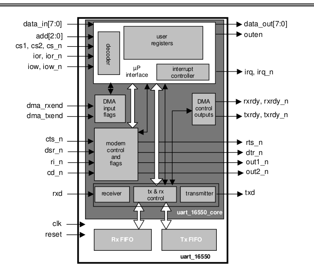

# uart registers- part 3

This page is unnecessary if you can read the 16550A datasheet on your own.  
This page tries to highlight some points extracted from the datasheet.  

Devices are connected via a physical layer. That physical layer has protocols within it.  
Protocols that outline things like : 
    - the way data gets packaged as signals
    - the speed at which bits should be transfered
    - the maximum distance between the connected devices
    - the limit on the number of connected devices
    - the decoding/encoding procedure
    - the Pin layout of the physical interface
    - .... (so much more)  

The UART happens to be a serial connection implementation. It can implement various physical-layer protocols like the RS-232, RS-422 and RS-485.   

There are many standards for creating a UART. THe one that will be discussed here will be the 16550 standard which has the following distinctive characteristics.  
1. Has the ability to convert data from serial to parallel, and from parallel to serial, using shift registers.
2. Has a multi-byte buffer for received data
3. Has another independent buffer for data that is yet to be transmitted
4. Has an interface that can interact with a DMA controller (interrupt-handling included)
5. Has an interface that can interact with the microprocessor (interrupt handling included)
6. Has Handshake lines for control of an external modem, controllable by software.

## Component tree
1. UART_16550A
   1. UART core
      1. microprocessor interface
         1. input decoder
         2. interrupt controller
         3. user/uart registers
      2. modem interface
         1. input decoder
         2. modem controller
      3. DMA interface
         1. input decoder
         2. DMA input controller
         3. DMA output controller
      4. rx/tx module
         1. receiver
         2. transmitter
         3. rx/tx controller
   2. FIFO buffers
      1. Tx Buffer
      2. Rx Buffer

## The 31 pins in the UART design  
The pins we are going to reference are from the schematic below: 

As seen in the diagram, the signals/pins have been grouped into: 
1. System signals
2. Microprocessor data interface
3. Interrupt signals
4. DMA interface
5. Modem interace

There are places where there are *redundant* pins. For example ior and ior_n. This redundancy ensures : 
- compatibility of the UART module across different boards
- flexibility to accomodate different signalling processes
- good old redundancy

### 1. The clock pin
The clock pin signal comes as an input to the UART module. During the rising-edge of the signal, all registers in the UART module moves.  

### 2. The Reset pin
A high signal via the Reset pin triggers a System reset: Every register resets asynchronously to a predefined state.    

### add[2:0]  
Uart-Register-index to read/write to.  

### Chip-select pins  
Many peripherals share the bus that connects them to other resources like memory and processor.  
To avoid conflicts, the connected peripherals only interact with the bus after they receive a `chip-select` signal from the processor.  
The UART module has both active-high and active-low chip-select pins for the sake of compatibility with boards ie. you do not have to change the active-level of your signal because the UART wants you to deliver active-high only.  

The UART module has 2 active-high chip-select pins for the sake of flexibility and redundancy.  
Flexibility:  
  - you can connect the chip to 2 different buses
  - Some systems may require one chip-select pin to interact with the address bus, while the other might be connected to a control line or system management unit. Having two chip-select pins ensures that the UART can be integrated into a wider variety of microprocessor or microcontroller systems, offering more design options
Redundancy: 
    - you can configure the UART such that chip-select becomes true if all 3 CS-pins attain a certain combination thereby reducing 'false positives'. This is better than relying on input from only one source.  

In our case, for any read or write operation to happen, cs1, cs2 and Cs_n must be set to HIGH, HIGH, LOW.  

###  IOr and IOr_n
This pins carry the `read_strobe`/`read_signal`. The processor sends the read strobe signal to the UART so that the UART can get prepared to be read from. This step looks unnecessary, but it gives the UART a heads up that it should get things in order before the read so that we avoid reading garbage. (it should rearrange the buffer if necessary, parity-check data in the data-received register and be ready to acquire access to the data-bus)  

In our case, A read operation is executed when the chip select condition is met and the signal ior is 1 while ior_n is 0.

### IOw and IOw_n
Just like IOr but for a write operation instead of a read operation.  
A write operation is executed when the chip select condition is met and the signal ior is 1 while ior_n is 0.

### data_in[7:0]
input data to be written to a UART register specified by the index supplied by the `addr[2:0]` pin

### data_out[7:0]
output data to be read from a UART register specified by the index supplied by the `addr[2:0]` pin

### outen
When High, it indicates that a valid register-read operation is ongoing in the current clock cycle. This info is releant to external devices such as an overall connetion-manager that has intermixed multiple UARTs. This pin can just be left unconnected if you have no use for it.  

### Interrupt signals (irq and irq_n)
If the uart wants to send an interrupt to the microprocessor, this output pin is toggled HIGH until the interrupt condition is removed using the UART driver. To reset the condition, the processor has to perform appropriate reads or writes to the UART. This is executed by the UART  
driver.  

### DMA signals (rxrdy and rxrdy_n)
When the UART wants to send data to memory via the DMA, it sends a rxsdy signal to the DMA controller.  

### DMA signals (txrdy and txrdy_n)  
When the UART wants to read data from memory via DMA, it sends a txrdy signal to the DMA controller.  

### DMA signals (dma_rxend and dma_txend)  
After the DMA-controller affirms that the read/write operation is complete, it sends dma_txend/dma_rxend to the UART as an interrupt and flag. 

### Modem signals.  
The modem signals are indentical to the [modem-handshake signals](./draft_2.md#a-handshaking-signals). The signals abstract the UART as the sender(Data terminal) and the remote modm as the receiver(Data Set)

- cts_n : Clear To Send. Used to provide flags and an interrupt.
- dsr_n : Data Set Ready. Used to provide flags and an interrupt.
- ri_n : Ring Indicator. Used to provide flags and an interrupt.
- cd_n : Carrier Detect. Used to provide flags and an interrupt.
- rts_n : Request To Send. Controlled by a register’s bit.
- dtr_n : Data Terminal Ready. Controlled by a register’s bit.  

There is no relation between the modem control block and the serial transmission/reception blocks

### Serial Communication signals (rxd and txd)
- txd : Serial output signal. This is the pin that is used to transmit the data bits from the UART to another remote receiver. When the UART is not communicting (ie idle) this signal hangs at a HIGH.  

- rxd : Serial input Signal. This is the signal that comes with received data coming from a remote UART. If there is no communication between the two UARTs, this signals hangs at a HIGH.  

The UART implements for the rxd input an anti-metastability filter followed by a majority filter.  
This inserts a delay of three clock cycles in the view of the rxd that the receiver has respect to a direct sampling of rxd.  

### General Purpose Outputs
There are two general purpose 1-bit output pins whose output values can be controlled by software (driver/firmware)  
These pins' value correspond to the state of a couple of bits in the Modem Control Register.  
Since one of these two bits can implement a standard global interrupt enable bit (depending on a synthesis option), the out2_n may
be not so “general-purpose”.  

## Operations using the above signals

### Data serialization
Using software, the driver will set bits in the line control register to determine the format of transmitted bits.  
The format of bits sent is as follows: 
- the first bit is a low signal that drops the idle state of the tx-line or the rx-line. This is the start bit.
- the bits that immediately follow are data-bits representing the actual message. They are collectively called a `word`. It is up to the driver to choose the word-length. It can be 5,6,7 or 8.
- an optional parity bit follows
- and finally, one or more stop bits follow. The stop bits are all LOWS (ie zeroes). The receiver only checks the first stop bit, with independence of the number of stop bits programmed.    

### Data Transmission  
With the help of the uart-driver, the microprocessor writes data(the word) to the Transmission Holding register. This data is pure data...it doesn't contain the start, parity or stop-bits. It fits the word-length configured in the Line control register.  

From there, the data is transferred to the Transmission Shift register starting with the least significant bit. This is where the serialization happens before transmission ; a start, stop and an optional parity bits are added.  
Data flows out through the `tx output pin`

The DMA does not directly push its data to the Transmission holding register. The DMA pushes to the Transmission FIFO buffer  

### Data Reception
The first point of contact is the anti-metastability filter followed by a majority filter. The anti-metastability filter introduces a 2-cycle delay for each bit-signal. The majority filter samples the bit with the assumption that the bit-cycle can be abstracted into 16-parts. This is why the maximum baud-rate is the max-clock-frequency divided by 16. (each bit == 16 clock cycles)  

The majority filter then transfers each averaged bit into the Receiver Shift register that converts the `word` into a parallel format. After full word-assembly, it transfers the data into the Receiver Holding Register where it is read from by the micro-processor.  

The errors that can occur during data reception are:  
1. **Parity Error**: Occurs when the parity bit does not reflect the actual parity of the received data. 
2. **Overrun Error** : this happens when the receiver receives a new word before the microprocessor reads the previously acquired word. This may results in a data loss if no additional circuitry is provided (eg circuitry that pastes the new word in an emergency buffer)
3. **Framing Error**: Happens when the stop-bit is a HIGH instead of a low.  
4. **Break Interrupt**: The break between interrupt should not be longer than a word-cycle. ie the stopbits should not run for an entire word-cycle. The Break interrupt error is thrown when stop-bits span an entire word-cycle  

### Baud rate setting
As earlier stated, the maximum baud-rate is the rate at which the 16-cycle-uart-bits are transmitted ie max_baud_rate = clock_frequency / 16

To avoid overrun errors, we use a baud rate that is lower than maximum baud rate. Also, if we get two uarts with differing clock frequencies, we choose to go with the one that has a slower process capability. 

To reduce the baud rate we use the following formulas.  
> max_baud_rate = clock_frequency / 16    
> baud_rate = maximum_baud_rate / { (Divisor_latch_register_value) * (Pre-scaler-division-register-value + 1)}  

setting the Pre-scaler-division-register is optional.  

### Interrupt handling operations   
The interrupt controller sends out interrupt signals to the microprocessor after checking out the following interrupt-info sources (arranged in accordance to priority): 
- level 1. Interrupt status register
- level 2. __
     1. Received Data Ready
     2. Reception Timeout
- level 3. Transmitter holding reg.Empty
- level 4. Modem Status
- level 5. DMA Reception End of Transfer
- level 6. DMA Transmission End of Trans. 

You can enable/disable the above six interrupt classes using the Interrupt enable register. It has bit spaces for each level of interrupt source.  
Interrupt-worthy events trigger a change in the values of the Interrupt-status-register. The `irq` pin will always be on a high unless the interrupt status register contains no  & enabled interrupt-worthy values.  
So to inform the UART that the micro-processor had dealt with an interrupt, you have to use the uart-driver to change the values of the interrupt-status-register.  

To help the driver in handling interrupts, the interrupt-status-register also provides the code of the current highest priority interrupt.  

#### Receiver line Status interrupts.  
These are interrupts that occur when the there's an error in receiving data. ie FramingError, ParityError and Break interrupt.  
If these errors are detected, the corresponding bits in the Line-Status-Register are set to High. The `irq` output pin also gets set High.  

#### Received Data Ready interrupts
This is an interrupt that gets sent under the following 2 conditions: 
1. If the UART is operating in 16450 mode and there is data in the Register-Holding-Register. To document this interrupt, the corresponding bit in the Line-status-register and the `irq` output get toggled to a High. Both values will be toggled to low once the micro-processor reads from the RHR.  
2. If the UART is operating in 16550 mode and the FIFO register has reached the limit of words set at the FIFO-Control-Register. To document this interrupt, the corresponding bit in the Line-status-register and the `irq` output get toggled to a High. Both values will be toggled to low once the micro-processor reads from the FIFO to a point that the number of buffered words go below the threshold set at the FCR. 

#### Reception Timeout interrupt  
In FIFO-mode a timeout interrupt is implemented independent of the FIFO threshold.   
This timeout interrupt is triggered if the UART is no longer receiving new data AND the FIFO has not reached its word-threshold.  
The timeout period is equal to 4 word-cycles. (The word-length used in the timeout calculation should be inclusive of the actual data plus all the start, stop and parity bits)  

The timeout interrupt is not reflected as a value in the UART registers such as the Interrupt status register.  

#### Transmitter Holding Register Empty
In 16450 mode, this interrupt gets triggered when the Trnsmitter Holding Register becomes empty.  
In 16550 mode, this interrupt is triggered when the FIFO buffer becomes empty.  
If the interrupt happens, it gets documented in the corresponding bit in the Line status register.  

#### Modem Status Interrupts
If enabled, an interrupt will be generated whenever a change is detected in the modem control input pins. For ri_n input the change must be from 0 to 1.  

This interrupt is directly related to bits 0 to 3 of the Modem Status Register.  

#### DMA interrupt signals
(undone)

### DMA operations
The UART provides the following 6 pins for DMA-interactions
- (rxrdy and rxrdy_n) output signals from UART to DMA-controller, they inform the controller that there is data ready to be read.  
- (txrdy and txrdy_n) output signals from UART to DMA-controller, they inform the controller that there the UART is ready to receive data through DMA.  
- (rxrdy_end and txrdy_end) input signals to UART from DMA-controller  

### Modem control  
All the modem output values can be set in the modem_control register.  
All the modem input values can be read in the modem_status register.  

All these pins are active low. The modem registers employ a positive polarity, so a low in the pins will reflect as a high in the registers.  
The MSR(Modem Status register) also provides flags to indicate a change in the status of the input pins. These flags can generate an interrupt to the microprocessor if desired.  

### FIFO buffers
The Uart can operate without the 16-byte buffers and instead depend only on the transmitter/Receiver holding register. This mode is usually referred as 16450 mode.  
But you can enable the FIFO-buffers using the FIFO-control register. It is also possible to check if FIFO buffers have been enabled by reading from the Interrupt status register.  

Being 8 bits the maximum data word length, the transmitter FIFO is 8-bits wide. However the receiver FIFO is by default 11-bits wide. This is due to the fact that the receiver does not only put the data in the FIFO, but also the error flags associated to each character. This last size can be reduced to 10-bits wide, without sensibly decreasing the compatibility, by using a synthesis options

