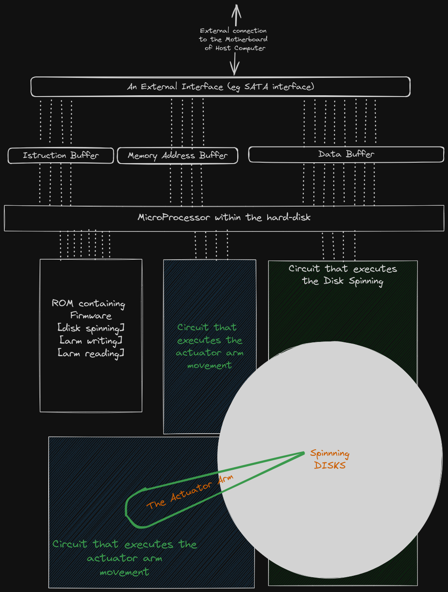
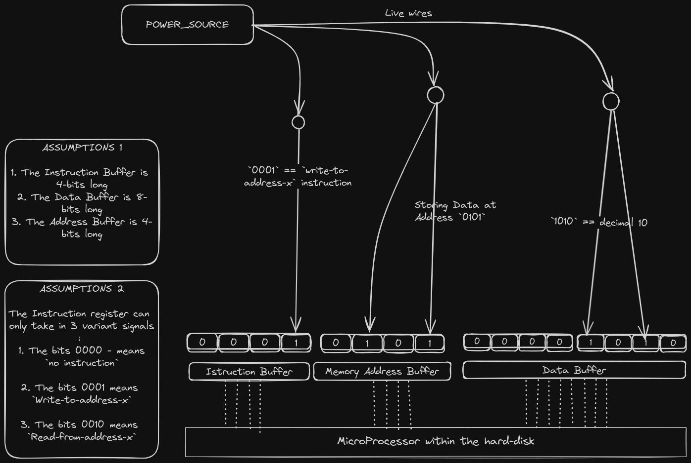
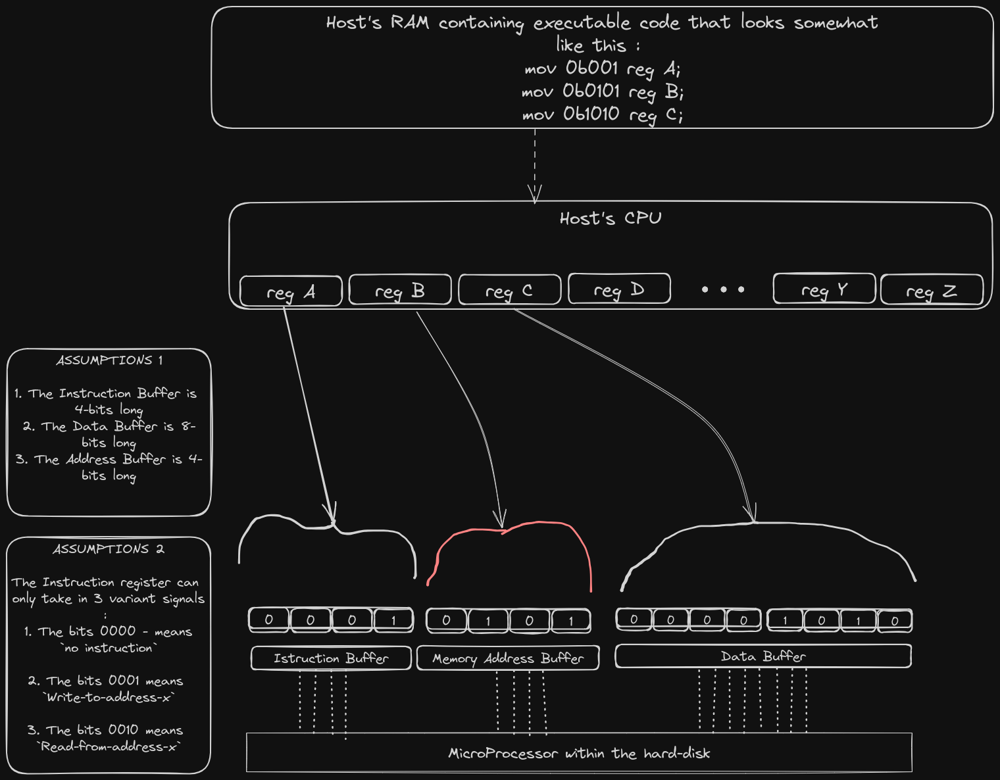

# Role 1 : Controlling the Physical device below

> **TLDR** :   
>Software controls the hardware below by either **Direct Register Programming** or **Memory Mapped Programming**. This can be done using Assembly language, low-level languages like C/Rust, or a mixture of both.  

In the previous page, we concluded that BOTH firmware and drivers control hardware.  
So, what does controlling hardware mean? How tf is that possible?  
What is Hardware??

Hardware in this case is a `meaningful combination of many electronic circuits`. 

### A Hard-disk example
For example, a Hard Disk is made up of circuits that store data in form of magnetic pockets, handle data-retrival, handle heat throttling, data encryption... all kinds of magic. 

In fact, let's try to make an imaginary-over-simplified DIY hard-disk.  
Here's a sketch...  
<figure>
  
  <figcaption>A DIY Hard-disk Sketch.</figcaption>
</figure>

Here is a break-down of the above image.  

1. **The External interface**  
   The external interface is the physical port that connects the Hard-disk to the host computer.   
   This interface has 2 functions: 
   - The interface receives an instruction, a memory address and data from the host computer and respectively stores them in the `Instruction Buffer`, `Memory Address Buffer` and `Data Buffer` found within the hard-disk. The acceptable instructions are only two: `READ_FROM_ADDRESS_X` and `WRITE_TO_ADDRESS_X`.  
   The `Memory Address Buffer` contains the address in memory where the host needs to either *read from* or *write to*.    
   The `Data Buffer` contains the data that has either *been fetched from the disk* or *is waiting to written to the disk*.   
   - The interface also receives data from within the hard-disk and transmits them to the Host computer
  
1. The ROM contains the Hard-disk's firmware. The Hard-disk's firmware contains code that ...
   - handles heat throttling
   - handles the READ and WRITE function of the Actuator Arm
   - handles the movement of the Actuator Arm
   - handles the spinning speed of the disks

2. A **small IC or processor** that fetches and executes both the Hard-disk's firmware and the instructions stored in the `Instruction Buffer`.  

   The micro-processor continuously does a fetch-execute cycle on both the `Instruction Buffer` and the ROM. 
   
   If the instruction fetched from the `Instruction Buffer` is `READ_FROM_ADDRESS_X`, the processor begins the READ operation.  
   If the instruction fetched from the `Instruction Buffer` is `WRITE_TO_ADDRESS_X`, the processor begins the WRITE operation.  

   **Steps of the READ operation...**  
   - The processor fetches the target memory address from the `Memory Address Buffer`.  
   - The processor fetches & executes the firmware code to spin the disks accordingly in order to facilitate a read from the target address.  
   - The processor fetches & executes firmware code to move the Actuator Arm to facilitate an actual read from the span disks.  
   - After the read, the processor puts the fetched data in the `Data Buffer`
   - The External Interface fetches data from the `Data Buffer` and transmits it to the Host.  
   - The processor clears the `Instruction Buffer`, `Memory Address Buffer` and `Data Buffer` in order to prepare for a fresh read/write     operation.  
   - The Read operation ends there.  

   **Steps of the WRITE operation...**  
   - The processor fetches the target memory address from the `Memory Address Buffer`. 
   - The processor acquires the data that is meant to be written to the Hard-disk. This data is acquired from the `Data Buffer`.  
   - The processor fetches & executes firmware code to spin the disks accordingly in order to facilitate a write to the target address.  
   - The processor fetches & executes firmware code to move the Actuator Arm to facilitate a write. 
   - The processor clears the `Instruction Buffer`, `Memory Address Buffer` and `Data Buffer` in order to prepare for a fresh read/write     operation.
   - The Write operation ends there.

### A manual driver?  
If we were in a zombie apocalypse and we had no access to a computer for us to plug in a hard-drive, how would we have stored data into the hard-disk?  

We could store data directly without using a computer with an Operating system that has hard-disk drivers. All we have to do is to supply meaningful electric signals to the external interface of the Hard-disk. You could do this using wires that you collected from the car you just stripped for parts. We are in an apocalypse, remember?

For example, to store the decimal number 10 into the address 0b0101, we could do this... 

Strip, the external interface off and access the 3 registers directly: The `Data Buffer` register, `Instruction Buffer` register & `Memory Address Buffer` register.  
From there, we could supply the electrical signals as follows...  

<figure>
  
  <figcaption>Apocalypse Driver, manual signal manipulation.</figcaption>
</figure>

Of-course, this experiment is very hard to do in real life. But come on, we are in an apocalypse and we have just build ourselves an 8-bit DIY hard-disk. Kindly understand.  

###  Programming
We are developers, we automate everything... especially when it is unnecessary.  
So how do we automate this manual manipulation of Hard-disk registers? How??   

Let us imagine that in the middle of the apocalypse, we found a host computer where we can plug in our DIY hard-disk.  

***Solution 1: Direct Register Programming***  

Now that we have access to a Host computer with a CPU, we can attach all the 3 registers DIRECTLY to the CPU of the host computer as shown in the figure below.  

To control which signals reach the individual bits of the 3 registers, we can write some assembly code to change the values of the native CPU registers. It is our assumption that the electrical signals will find their way to the attached registers... (basic electricity)  

This solution gets the job done.  
This solution is typically known as **Direct register programming**. You directly manipulate the values of the CPU registers, which in turn directly transfer the values to the registers of the external device.  

<figure>
  
  <figcaption>DIY_disk direct register programming.</figcaption>
</figure>

***Solution 2: Memory Mapped Programming***  
The CPU has a limited number of registers. For example, the bare minimum RiscV Cpu has only 32 general registers. Any substantial software needs more than 32 registers to store variables. The RAM exists because of this exact reason, it acts as extra storage. In fact the stack of most softwares gets stored in the RAM.  

The thing is... registers are not enough.  
So instead of directly connecting the Hard-disk registers to the limited CPU registers, we could add the external-device registers to be part of the address space that the CPU can access.  

We could then write some assembly code using standard memory access instructions to indirectly manipulate the values of the associated hard-disk registers. This is called Memory-mapped I/O programming (**mmio programming**).  

MMIO maps the registers of peripheral devices (e.g., I/O controllers, network interfaces) into the CPU’s address space. This allows the CPU to communicate with these devices using standard memory access instructions (load/store)

This is the method that we will stick to because it is more practical.  

You could however use Direct Register Programming when building things like pace-makers, nanobots or some divine machine that is highly specialized and requires very little indirection when fetching or writing data to addresses.  
This is because dedicated registers typically perform better than RAMS and ROMS in terms of access-time.    

### Summary
The driver controls the hardware below by either **Direct Register Programming** or **Memory Mapped Programming**. This can be done in Assembly, low-level languages like C/Rust, or a mixture of both.  
