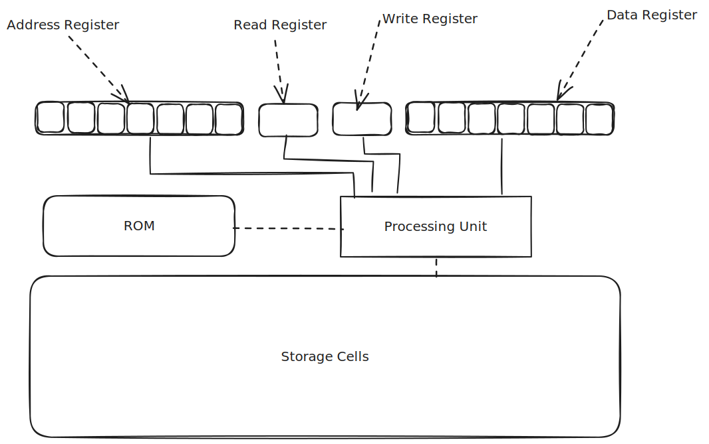
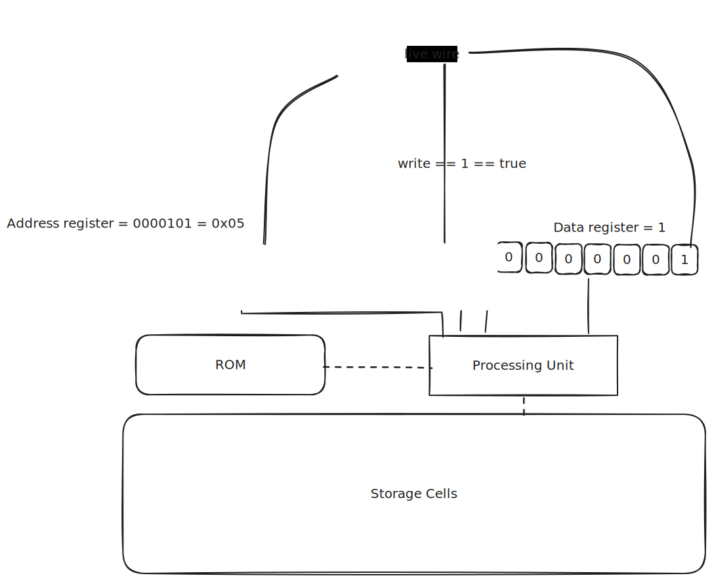
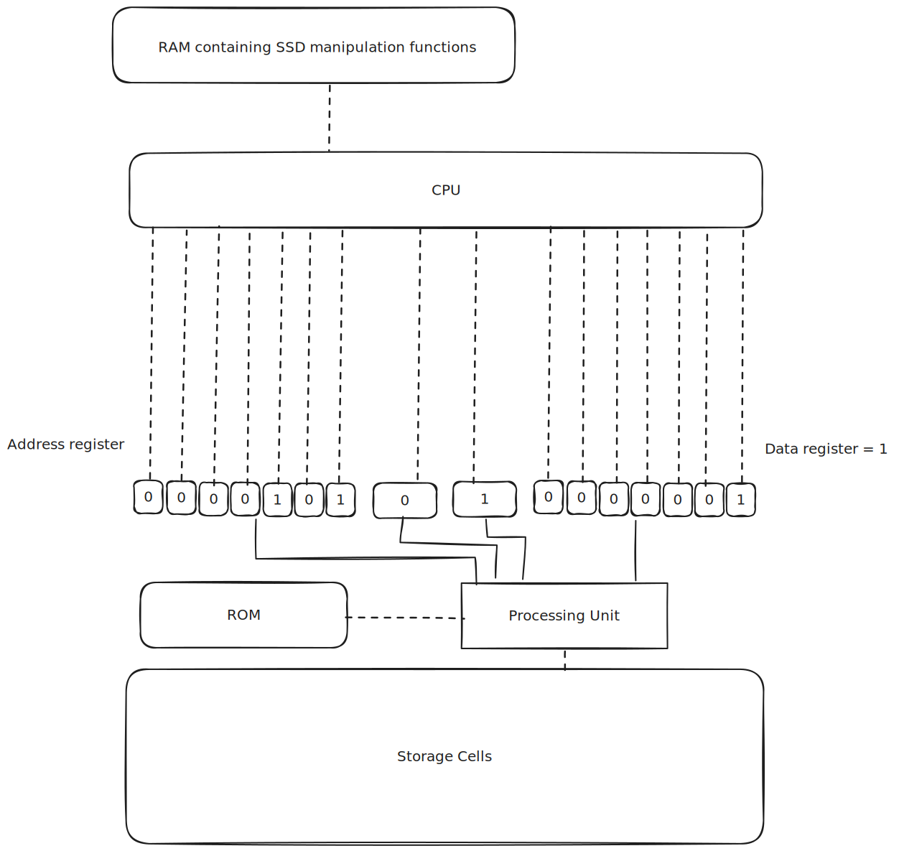
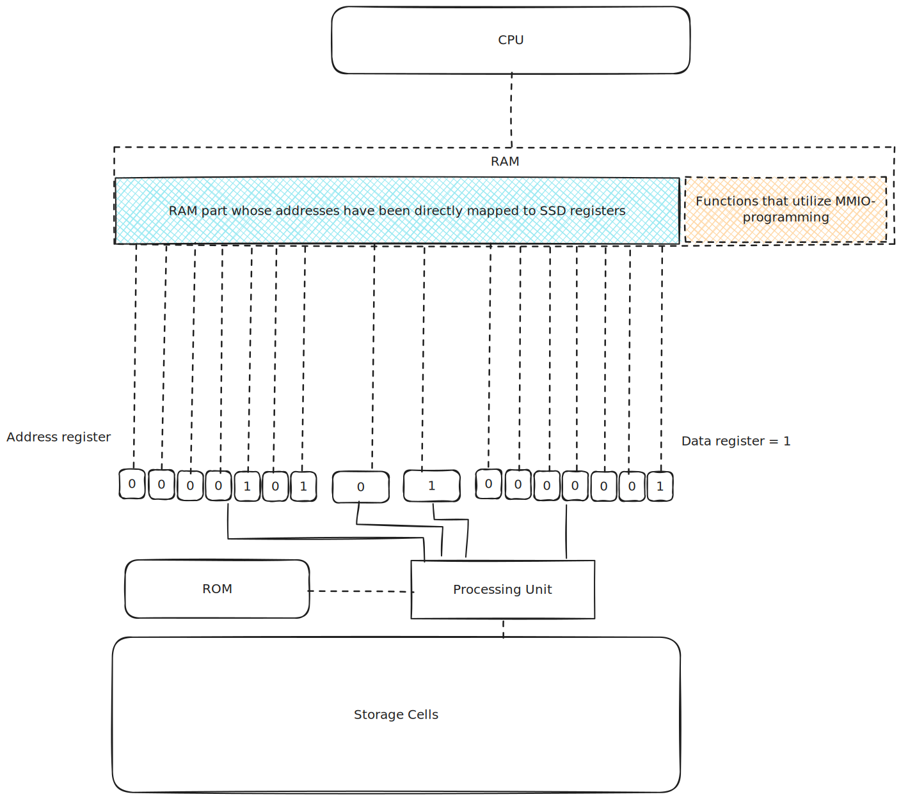

# Role 1 : Controlling the Physical device below

**TLDR** :  
The driver controls the hardware below by either **Direct Register Programming** or **Memory Mapped Programming**. This can be done in Assembly, low-level languages like C/Rust, or a mixture of both.  

A physical device is a piece of electronic that does things, for example, an SSD disk stores data. You can read and write to that SSD device.  

An SSD is roughly made up of : 
1. Storage cells
2. A small IC or processor that implements the SSD's firmware
3. The SSD's firmware stored in the SSD's ROM
4. Exposed registers

The only way to interact with the device is through the exposed registers.  

To make the device do things, you meaningfully supply electrical signals to the exposed registers. Once the CPU detects signals on the registers, it interprets them as parameters for the functions defined in the firmware. From there, the firmware does its duties.  

Here is an extremely over-simplified and incorrect view of the SSD :  

Usage :
1. To store data to the SSD...
   1. You write an 8-bit address to the address register. This is called the 'destination address': it is the memory address of the place you want to write to in the SSD.  
   2. You write the 8-bit data that you wanted to store in the data register. This is called the 'subject data'   
   3. You make sure that the read register is not receiving any signal. This gets translated as 'read == false'.
   4. You supply an electric signal to the write register. This electrical signal is translated as 'write == true'.
   5. The SSD processor detects a signal in the 'write' register and immediately does the following : 
      - It starts executing the "write function" found in the firmware code. 
      - It passes the 'destination' address and the 'subject data' to it
      - Viollah! The write operation is complete.  

### A manual driver?  
If we had the ssd and a couple of electric wires only, we could store data without using a driver. All we have to do is to supply meaningful electric signals to the registers of the ssd.  

For example, to store the number 1 into the address 0x05, we could do this... 
  

###  Programming
We are developers, we automate everything... especially when it is unnecessary. Our superpower.  
So how do we automate this manual manipulation of SSD registers? How?? Panic everywhere!!   

***Solution 1: Direct Register Programming***  

We attach all the SSD registers DIRECTLY to the CPU. And then write some assembly code to change the values of the attached registers...  
This solution gets the job done.  

Demo: 

***Solution 2: Memory Mapped Programming***  
The CPU has a limited number of registers. The RAM exists because of this exact reason.  
So instead of directly attaching the SSD registers to the limited CPU registers, we could attach them to the RAM instead.  

We could then write some assembly code to manipulate RAM addresses, hence indirectly manipulating the values of the SSD registers. This is called Memory-mapped I/O programming (**mmio programming**).  

This is the method that we will stick to because it is more practical.  

You could however use Direct Register Programming when building things like pace-makers, nanobots or some divine machine that is highly specialized and requires 100% performance.  

Here is a demo of a naive MMIO setup : 

### Summary
The driver controls the hardware below by either **Direct Register Programming** or **Memory Mapped Programming**. This can be done in Assembly, low-level languages like C/Rust, or a mixture of both.  
