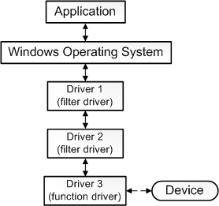

# Types of Drivers

Classifications and fancy words do not matter, we go straight to the list of driver-types.  
Drivers are classified according to : 
1. How close the driver is to the metal.
2. What the function of the driver is.

## Drivers classified by their level of abstraction.
Like earlier mentioned, drivers are abstractions on top of devices. And it is well known that abstractions exist in levels; you build higher-level abstractions on top of lower level abstractions.  

Here are the two general levels in the driver-world.

1. **Function drivers** : these drivers implement functions that directly manipulate the external device's registers. You could say that these drivers are the OG drivers. They are at the lowest-level of abstraction. They are one with the device, they are one with the metal.    
 
2. **Filter drivers/ Processing drivers/ Wrapper drivers**: These drivers take input from the function drivers and process them into palatable input and functions for the kernel. They can be seen as 'adapters' between the function-driver and the kernel. They can be used to implement additional security features. Point being, their main function is wrapping the function-driver.  

Oh look... this 👇🏻 is what we were talking about... thanks windows for your docs.  
  
This image was borrowed from the [Windows Driver development docs][Windows_driver_development_docs]  

>*A driver stack* is a collection of different drivers that work together to achieve a common goal.   

## Drivers classified by function  

This classification is as straightfoward as it seems. eg Drivers that deal with hard-disks and SSDs are classified as `storage` drivers. More examples are provided below:  

- storage drivers : eg ssd drivers
- Input Device Drivers
- Network Drivers
- Virtual drivers (Emulators)
- This list can be as long as one can imagine... but I hope you get the drift

IMO, classification is subjective, a driver can span across multiple classifications.  

[Windows_driver_development_docs]: https://learn.microsoft.com/en-us/windows-hardware/drivers/gettingstarted/what-is-a-driver-