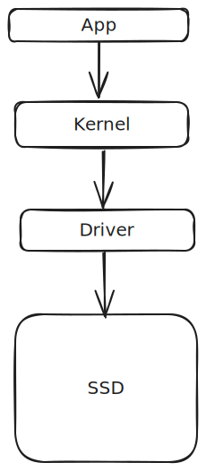

# Intro to Drivers

This chapter is filled with definitions.  

And as you all know, there are NO right definitions in the software world. People still debate what 'kernel' means. People are okay using the word 'serverless' apps. It's chaos everywhere.  

So the definitions used here are constrained in the context of this book.  

### What's a driver?

A driver is a piece of software that sits in between a high-level program and a physical device. The high level program could be a kernel in this case. And the physical device could be an SSD disk attached to the motherboard.  

The driver has 2 primary functions : 
1. Controlling the underlying device. (the SSD)
2. Providing an interface for the kernel/higher-level program to interact with. The interface could contain things like public functions, data_structures, message passing endpoints...

Bird's view :  

Demo : 

Let's break down the two main roles of the driver... 

