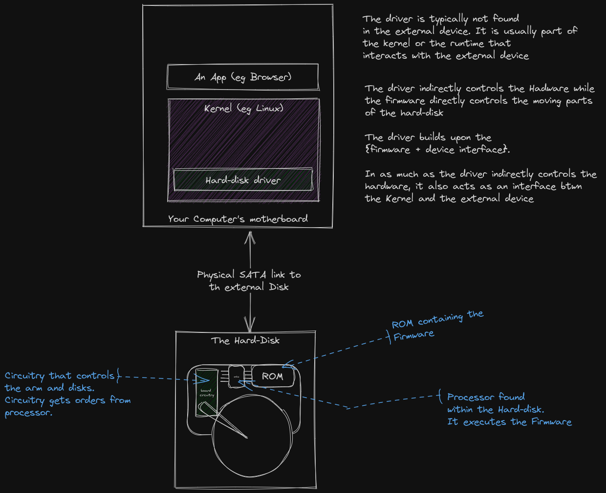
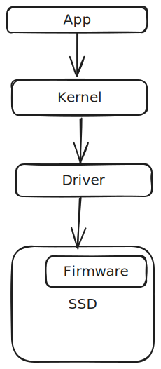

# Intro to Drivers

This chapter is filled with definitions.  

And as you all know, there are NO right definitions in the software world. People still debate what 'kernel' means. People are okay using the word 'serverless' apps. What does AI even mean? It's chaos everywhere.  

So the definitions used here are constrained in the context of ***this*** book.  

### What's a driver?  What's firmware?  

Drivers and firmwares do so many things. It is an injustice to define them like how I have defined them below. In truth, the line between drivers and firmware is thin. (we'll get back to this... just forget that I mentioned it).   

But here goes the watered down definitions... 

#### Firmware  

**Firmware** is software that *majorly* controls the hardware. It *typically* gets stored in the ROM of the hardware  

For example, an external hard-disk device has firmware that controls how the disks spin and how the actuator arms do their thing.  
That firmeare code is independent of any OS or Runtime... it was code specifically built for that hard-disk's internal components.  
You may find that the motherboard of the hard-disk has a small processor that fetches the firmware code from the embedded ROM amd processes it.  

#### Driver

On the other hand, a **Driver** is software that *also* controls the hardware AND provides a higher level interface for something like a kernel or a runtime. The driver is typically stored as part of the kernel.  

The above definitions are confusing? Ha?  
Here is an image to confuse you further...  

A driver typically sits in-between a high-level program and the physical device.  
The high level program could be a kernel in this case. And the physical device could be an hard-disk attached to the motherboard.  

The driver has 2 primary functions : 
1. Control the underlying device. (the hard-disk)
2. Provide an interface for the kernel/higher-level program to interact with. The interface could contain things like public functions, data_structures and message passing endpoints that somehow manipulate how the driver controls the underlying device...

Here is a Bird's eye-view of the driver-to-firmware ecosystem:  

Let's break down the two main roles of the driver in the next chapter...   

But before we turn the page, remember when we said that the line between drivers and firmware is thin?  
Well... here is an [explanation](../misc/drivers_vs_firmware.md)

